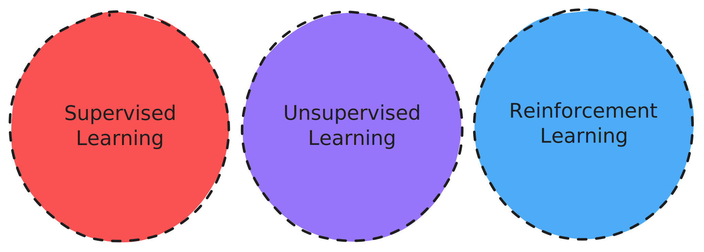

# 📌 Введение в машинное обучение  

## 🧐 Что такое машинное обучение?  
> 📌 **Формальное определение:**  
> Машинное обучение (ML) — это процесс, при котором программа обучается на основе опыта **$E$** по отношению к некоторому классу задач **$T$** и некоторой мере эффективности **$P$**, если её **эффективность** при решении задач из **$T$**, измеряемая с помощью **$P$**, **повышается с опытом** **$E$**.
>  
> — *Tom Mitchell, Machine Learning (1997)*

## 🚀 Машинное обучение и путь к искусственному интеллекту

Это значит, что если ваша программа начинает лучше работать при увелечении у нее опыта, а в машинном обучении опыт можно интерпретировать как количество данных, которые были обработаны этой самой программой, то в этом случае мы имеем дело с обучаемой программой.

### 📌 Главный принцип машинного обучения  
Это говорит нам о том, что в попытках решить какую-либо задачу или улучшить качество решения, нам не нужно модифицировать сам алгоритм программы, или как либо изменять её код, а все что нужно это позволить ей приобрести больше опыта (дать больше данных). 

### 🔄 Эволюция подходов в машинном обучении  
Развитие машинного обучения можно представить как **движение к унификации**:

1. **1990-е годы** – для каждой задачи разрабатывался **уникальный алгоритм** и использовались **специфические данные**.  
2. **2000-е – 2010-е** – появилось понимание, что **один алгоритм** может решать **разные задачи**, а выбор задачи определяется **различными наборами данных**.  
3. **Сегодня** – стремление к **универсальным алгоритмам**, которые могут решать **широкий спектр задач** без изменения архитектуры.  

### 🌍 Путь к сильному ИИ (AGI)  
В будущем, когда **единый алгоритм** сможет решать **все интеллектуальные задачи**, мы достигнем так называемого **AGI (Artificial General Intelligence, искусственного интеллекта общего назначения)**.  

Этот момент станет **точкой перелома**, когда ИИ сможет:  
✅ Самостоятельно адаптироваться к новым задачам  
✅ Обучаться без необходимости в специализированных данных  
✅ Обладать гибкостью, сравнимой с человеческим интеллектом  

🔹 **AGI** – это не просто система, выполняющая конкретные задачи, а **настоящий универсальный интеллект**, способный понимать, рассуждать и обучаться в любых областях.  

## 🔍 Что нужно знать про машинное обучение?

Машинное обучение охватывает широкий спектр методов — от **базовых алгоритмов** до **современных моделей**, таких как **ChatGPT, GPT-4, DeepSeek, LLaMA и другие LLM (Large Language Models)**.  

Однако, **все** эти технологии строятся на **трёх ключевых компонентах**.  

### 📌 Три парадигмы машинного обучения  
Все алгоритмы машинного обучения можно классифицировать по **трём основным подходам**:  

1. **🔴 Supervised Learning (обучение с учителем)**  
   - Алгоритм обучается на размеченных данных, где каждому входному примеру соответствует **правильный ответ**.  
   - Примеры: **линейная регрессия, решающие деревья, нейросети**.  

2. **🟣 Unsupervised Learning (обучение без учителя)**  
   - Модель ищет **скрытые закономерности** в данных без заранее заданных меток.  
   - Примеры: **кластеризация, снижение размерности, ассоциативные правила**.  

3. **🔵 Reinforcement Learning (обучение с подкреплением)**  
   - Агент принимает **последовательные решения**, получая награды или штрафы за свои действия.  
   - Примеры: **AlphaGo, роботы, рекомендательные системы**.  

📌 Вся экосистема ML строится **на комбинациях этих трёх подходов**.  

## 📌 Прогрессивные подходы в машинном обучении

Все продвинутые подходы в машинном обучении, которые появились в последние годы, можно рассматривать как **суперпозицию** (объединение) базовых парадигм, таких как **обучение с учителем**, **обучение без учителя** и **обучение с подкреплением**. Эти подходы **расширяют возможности** и позволяют решать задачи **более высокого уровня**.

### 🧠 Прогрессивные подходы машинного обучения

1. **Generative Adversarial Learning (Генеративное противостоящее обучение)**  
   - Включает в себя **двухсетевые структуры** — генератор и дискриминатор, обучающиеся одновременно и соревнующиеся друг с другом.  
   - Пример: **создание фальшивых изображений (Deepfakes)**.

2. **Self-supervised Learning (Самообучение)**  
   - Используется для **самостоятельного извлечения структуры из данных**, создавая задачи для предсказания скрытых частей данных без явных меток.  
   - Пример: **предсказание части данных (например, слова в предложении)**.

3. **Transfer Learning (Обучение с переносом)**  
   - Модели, обученные на одной задаче, **переносят знания** на другую, схожую задачу, минимизируя необходимость в больших объемах данных для новой задачи.  
   - Пример: **предобученные модели для обработки изображений (ResNet, VGG)**.

4. **Weakly-supervised Learning (Слабое обучение с учителем)**  
   - Использует **слабую разметку** данных, например, частичную информацию или менее точные метки.  
   - Пример: **аннотированные данные с ошибками или неполными метками**.

5. **Semi-supervised Learning (Полуобучение)**  
   - Сочетает **размеченные и неразмеченные данные** для обучения модели. Используется, когда размеченные данные слишком дороги или трудоемки для получения.  
   - Пример: **кластеризация с использованием частичных меток**.

6. **One-shot Learning (Обучение с одного примера)**  
   - Способность обучаться на **одном единственном примере** для классификации нового объекта.  
   - Пример: **распознавание лиц или объектов с минимальным количеством примеров**.

### 🎯 Эти подходы позволяют решать более высокоуровневые задачи:

- **Content Generation (Генерация контента)**  
- **Game AI (Искусственный интеллект для игр)**  
- **Visual Recognition (Распознавание изображений)**  
- **Forecasting (Прогнозирование)**  
- **Anomaly Detection (Обнаружение аномалий)**  
- **Exploratory Data Analysis (Исследовательский анализ данных)**  
- **Metric Learning (Изучение метрик)**  
- **Sequence-to-sequence Learning (Обучение последовательности к последовательности)**

### 💡 Применение для создания коммерческих систем:

Эти прогрессивные подходы становятся основой для множества коммерческих приложений и систем, таких как:

- **Video Analysis (Анализ видео)**  
- **Manufacturing Defect Detection (Обнаружение дефектов в производстве)**  
- **Robotics (Робототехника)**  
- **Text-to-speech (Текст в речь)**  
- **Person Re-Identification (Идентификация личности)**  
- **Face Recognition (Распознавание лиц)**  
- **Text Recognition (Распознавание текста)**  
- **Medical Diagnosis (Медицинская диагностика)**  
- **Recommender Systems (Рекомендательные системы)**  
- **Machine Translation (Машинный перевод)**  
- **Speech Recognition (Распознавание речи)**

### 📌 Базовые алгоритмы — строительные блоки для сложных систем

Когда речь идет о базовых алгоритмах машинного обучения, важно понимать, что **они являются всего лишь маленькими строительными блоками**. Эти блоки в совокупности создают **сложные интеллектуальные системы**, которые способны решать разнообразные задачи.  
Каждый из этих подходов и алгоритмов позволяет **постепенно строить все более сложные решения**, ведущие к созданию эффективных систем ИИ.
