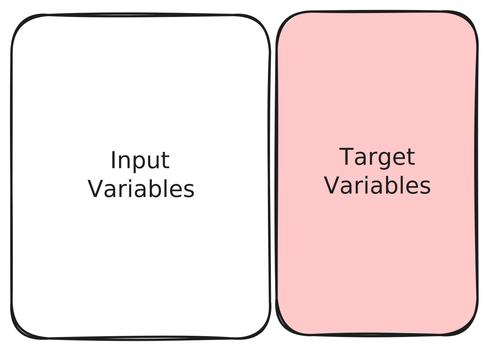

# 📌 Введение в машинное обучение  

## 🧐 Что такое машинное обучение?  
Машинное обучение (ML) — это процесс, при котором **компьютерная программа обучается** на основе опыта $E$ в решении задач класса $T$ и оценивается по мере эффективности $P$.  

> 📌 **Формальное определение:**  
> Говорят, что программа обучается на основе опыта **$E$** по отношению к некоторому классу задач **$T$** и некоторой мере эффективности **$P$**,  
> если её **эффективность** при решении задач из **$T$**, измеряемая с помощью **$P$**, **повышается с опытом** **$E$**.

---

## 🎯 Парадигма: Self-Supervised Learning  
Мы находимся в **парадигме Self-Supervised Learning**.  

📌 **Что это означает?**  
- В этом подходе алгоритм обучается **на размеченных данных**, где правильные ответы **уже содержатся** в выборке.  
- В отличие от классического Supervised Learning, в Self-Supervised разметка получается **автоматически** из самих данных.  

---

## 🖼️ Входные и целевые переменные  

На схеме ниже показаны **входные (input) и целевые (target) переменные** для задачи машинного обучения:  

  

---

⏭ **Далее:** Погружаемся в **линейную регрессию**, один из базовых алгоритмов машинного обучения! 🚀  

