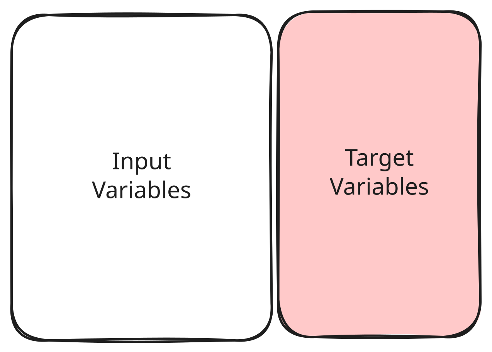

## 🖼️ Входные и целевые переменные  

Supervised Learning (обучение с учителем) - можно с уверенностью сейчас сказать, что это самый важный концепт, просто потому что даже самые высокие результаты которые показывают алгоритмы, основаны на обучении с учителем.

Так в чем же основная идея обучения с учителем?
Самая главная идея в том, что у нас есть «правильные» ответы, для входных данных.

На схеме ниже показаны **входные (input) и целевые (target) переменные** для задачи машинного обучения:  

  

---

⏭ **Далее:** Погружаемся в **линейную регрессию**, один из базовых алгоритмов машинного обучения! 🚀  
Что важно?

Input variables - некоторые D-мерные векторы (векторы признаков, но сейчас, мы не задумываемся о природе этих признаков):
$\mathbf{x}_1, \mathbf{x}_2, \ldots, \mathbf{x}_n \in \mathbb{R}^D$
Или если подробнее:
$\mathbf{x}_1 = (x_{1}^{(1)}, x_{1}^{(1)}, x_{1}^{(1)}, \ldots, x_{D}^{(1)})^T$
$\mathbf{x}_2 = (x_{1}^{(2)}, x_{2}^{(2)}, x_{3}^{(2)}, \ldots, x_{D}^{(2)})^T$
$\vdots$ $\vdots$ $\vdots$ $\vdots$ $\vdots$ $\vdots$ $\vdots$ $\vdots$ $\vdots$ $\vdots$ $\vdots$ $\vdots$ $\vdots$ $\vdots$ $\vdots$ $\vdots$ $\vdots$ $\vdots$ $\vdots$ $\vdots$ $\vdots$ $\vdots$ $\vdots$ $\vdots$
$\mathbf{x}_n = (x_{1}^{(n)}, x_{2}^{(n)}, x_{3}^{(n)}, \ldots, x_{D}^{(n)})^T$

Что касается целевых переменных target variables, то они могут быть как скалярными, так и векторными величинами:
$\mathbf{t}_1, \mathbf{t}_2, \ldots, \mathbf{t}_N \in \mathbb{R}^n$

«99%» того что вы будете делать в обучении с учителем, будет сводиться к одному из следующих двух случаев или их комбинации:

1. **Regression** - задача регрессии, т.е предсказание непрерывного значения. Метки $t_i$ являются скалярными значениями, либо векторными значениями, но в любом случае, они являются непрерывными. $t_i \in \mathbb{R}^n$
Примеры:
- Предсказание цены автомобиля в зависимости от его характеристик
- Предсказание оценки студента в зависимости от количества часов обучения
- Предсказание вероятности отказа оборудования в зависимости от его возраста
- Предсказание цены недвижимости в зависимости от ее характеристик

2. **Classification** - задача классификации, т.е предсказание дискретного значения (категории, класса)
$t_i \in \{1, 2, \ldots, C\}$
Примеры:
- Что изображено на изображении?
- Болен человек или нет?
- Является ли электронное письмо спамом?
- Является ли этот звук тихим или громким?
- Является ли этот электронный документ легальным?

Что интересно, люди, которые только погружаются в машинное обучение, они могут не чувствовать принципиальной разницы между этими двумя задачами. Например, мы предсказываем курс доллара в рублях на завтрашний день, и мы можем сказать, что нас интересует предсказание с точностью целых значений рублей. И допустим будем решать эту задачу, как задачу классификации, заведя 200 классов от 1 до 200, и будем предсказывать к какому классу относится курс доллара.

Самая главная проблема в такой постановке в том, что в задаче классификации, и регрессии мы по разному воспринимаем ошибки для целевых функций в этих задачах (о которых мы поговорим позже). Для классификации, стоимость ошибки при придсказании класса $C_1$ вместо $C_2$, ничем не отличается от ошибки при придсказании класса $C_2$ вместо условного $C_{10}$, т.е в задаче классификации нас не наказывают больше или меньше за ошибку. Но что с точки регрессии, при предсказании курса ошибка в 1 рубль, и ошибка в 20 рублей, это совершенно разные вещи.

Материалы:
1. [YouTube. Евгений Разинков. AI: от основ до трансформеров. Обучение с учителем. Лекция 2.](https://www.youtube.com/watch?v=MGmrCV6AbAI&list=PL6-BrcpR2C5Q1ivGTQcglILJG6odT2oCY&ab_channel=%D0%95%D0%B2%D0%B3%D0%B5%D0%BD%D0%B8%D0%B9%D0%A0%D0%B0%D0%B7%D0%B8%D0%BD%D0%BA%D0%BE%D0%B2)
