# **[ШАД] Лекция 1: Intro to MLLMs. Image Modality**

> **MLLMs** (Multimodal Large Language Models) — модели, работающие с несколькими модальностями (текст + изображение/аудио/видео).


## **1. MLLMs как шаг к AGI**
**MLLMs** - естественный этап развития искусственного интеллекта в сторону **AGI**. Их создание основано на гипотезе, что обработка множества модальностей приближает модели к человеческому мышлению.

### **🔍 Основные аспекты**
1. **Сенсорная интеграция (Sensor Fusion)**  
   Объединение данных разных типов (текст, изображения и др.) позволяет моделям воспринимать информацию комплексно, как это делает человек.

2. **Использование знаний LLM**  
   Языковые модели служат универсальной базой знаний о мире. Добавление других модальностей (например, визуальной) расширяет их способность к рассуждениям.  
   *Пример*: В отличие от классического компьютерного зрения, MLLM анализируют изображения в контексте языковых знаний.

3. **Новые возможности на стыке модальностей**  
   Комбинация текста и изображений открывает уникальные приложения:  
   - Визуальный поиск,  
   - Генерация контента,  
   - Медицинская диагностика по снимкам + анамнезу.

4. **Повышение качества через мультимодальные паттерны**  
   Совместная обработка данных выявляет скрытые закономерности, недоступные для одномодальных моделей.  
   *Пример*: Модель может коррелировать стиль изображения с эмоциональной окраской текста.

<div style="text-align: center">
  
</div>


## **2. Static Benchmarks**
### **2.1 GQA: Compositional Visual Question Answering Benchmark**
> **Hudson A. et al.** *"GQA: A New Dataset for Real-World Visual Reasoning and Compositional Question Answering"*  
**CVPR 2019** | [Article](https://arxiv.org/pdf/1902.09506) | [Dataset](https://cs.stanford.edu/people/dorarad/gqa/)

GQA (Visual Question Answering) — это датасет для оценки способности моделей к реальному визуальному мышлению, по композиционным вопросам.

> В оригинальной статье авторы *(Hudson & Manning)* намеренно не дают явной расшифровки аббревиатуры.

#### **📌 Характеристики датасета**
- **113k изображений** собранных с Flickr
- **22.6M вопросов** сложных композиционных вопросов
- **Графовая разметка**:  
  - Полуавтоматическое выделение объектов и связей (стрелки, подписи)  
  - Семантическая структура диаграмм → вопросы  
- 📊 **Метрика**: Accuracy


[](https://arxiv.org/pdf/1902.09506)

**Методология создания датасета**
1. **Графовая разметка изображений**:
    - Каждое изображение аннотируется как ориентированный граф
    - Узлы графа - это объекты на изображении (чашка, девочка, гамбургер)
    - Каждый узел может иметь несколько аттрибутов (например, цвет, форма, текстура, состояние)
    - Ребра графа - это пространственные и семантические отношения между узлами
    - Пространственные: "слева от", "на", "под", "за"
    - Действия или же глаголы: "держит", "ест", "смотрит на"

2. **Генерация вопросов**:
  Далее по такой разметке можно генерировать большое количество вопросов. В начале берутся какие-то паттерны вопросов, и добавляются правила обхода графа. Стартуя с какой-то вершины и можем задавать вопросы либо про атрибуты либо про отношение между объектами, и чем больше пройдем по графу, тем сложнее вопросы становятся, но можно выделить 3 типа вопросов:
    1. **Атрибутивные** (о свойствах объектов):
    *"Какого цвета чашка?"*
    2. **Реляционные** (о связях между объектами):
    *"Что держит девочка?"*
    3. **Композиционные** (многоуровневые):
    *"Какого цвета еда на красном объекте слева от девочки?"*


### **2.2 AI2D Diagram Understanding Benchmark**
> **Kembhavi A. et al.** *"A Diagram is Worth A Dozen Images"*  
**ECCV 2016** | [Article](https://arxiv.org/pdf/1603.07396) | [Dataset](https://huggingface.co/datasets/lmms-lab/ai2d)

#### **📌 Характеристики датасета**
- **5k изображений** из школьных учебников (физика, биология)  
- **15k вопросов** с множественным выбором (*multiple choice*)  
- **Графовая разметка**:  
  - Полуавтоматическое выделение объектов и связей (стрелки, подписи)  
  - Семантическая структура диаграмм → вопросы  
- 📊 **Метрика**: Accuracy

[](https://arxiv.org/pdf/1603.07396)

#### **🔧 Исходные задачи**
1. **Diagram Parsing**
   Отображение картинок в граф диаграммы. Т.е с начала отдельной моделью парсят картинку и получают граф.
2. **Question Answering**  
   Чтобы из графа получить ответ на вопрос, его текстовое описание подается в LLM вместе с вопросом. 

> *Современный подход*: Используют End-to-end подход к предсказаниям, т.е напрямую из изображения диаграммы, вместе с вопросом, получают ответ (в таком формате обычно этот датасет используется для тестирования моделей). 


### **2.3 MMMU: Massive Multi-discipline Multimodal Understanding Benchmark**
> **X. Yue. et al.** *"MMMU: A Massive Multi-discipline Multimodal Understanding and Reasoning Benchmark for Expert AGI"*  
**CVPR 2024** | [Article](https://arxiv.org/pdf/2311.16502) | [Dataset](https://huggingface.co/datasets/MMMU/MMMU)

#### **📌 Характеристики датасета**
- **11.5k вопросов с изображениями** из 6 университетских дисциплин:
    - бизнес
    - искусство и дизайн
    - инженерия
    - медицина
    - социальные науки
    - ествественные науки (математика)
- **95%** вопросов с множественным выбором, **5%** — открытые
- **Источники**:
    - Учебники университетского уровня (тщательно проверенные на соответствие лицензиям)
    - Тестовые задания и задачи с экспертными решениями
- 📊 **Метрика**: Accuracy

[](https://arxiv.org/pdf/2311.16502)

#### **🔧 Методология оценки**
- Автоматическая проверка:
  - Для вопросов с выбором - точность (Accuracy)
  - Для открытых вопросов - ответы извлекались используя сложный пайплайн rexexps


### **2.4 TextVQA: Visual Question Answering in Text-Rich Images**
> **Singh et al.** *"Towards VQA Models That Can Read"*  
**CVPR 2019** | [Article](https://arxiv.org/pdf/1904.08920) | [Dataset](https://textvqa.org/)

#### **📌 Характеристики датасета**
- **28k изображений** с текстовыми элементами (вывески, этикетки, цифры)
- **45k вопросов**, требующих чтения текста на изображении
- **10 референсных ответов** на каждый вопрос (аннотировано краудсорсингом)
- **Источник данных**:  
   - Фильтрация исходного датасета VQA v2.0  
   - Дополнительный сбор текстоемких изображений  
- 📊 **Метрика**: VQA accuracy (нормализованная точность)

[](https://arxiv.org/pdf/1904.08920)

#### **🔍 Ключевые особенности**
1. **Цель создания**:  
   - Тестирование способности моделей **к чтению и интерпретации текста** в визуальном контексте  
   - Пример вопроса:  
     *"Какой номер на билете у человека в красной шапке?"*

2. **Методология оценки**:  
   - Ответ модели сравнивается с 10 эталонными ответами  
   - Оценка точности:  
     - 100% — если ответ совпадает с ≥3 референсами
     - 66% — если совпадает с 2 референсами
     - 33% — если совпадает с 1 референсом


Авторы заметили, что достаточно много вопросов о сцене можно спросить у модели, с которыми нельзя справиться если не уметь распознавать символы или цифры.


### **2.5 DocVQA: A Dataset for Multimodal Document Understanding**
> **Mathew et al.** *"DocVQA: A Dataset for VQA on Document Images"*  
**WACV 2021** | [Article](https://arxiv.org/pdf/2007.00398) | [Dataset](https://www.docvqa.org/datasets)

#### **📌 Характеристики датасета**
- **50k изображений документов**  
- **12k вопросов** с аннотированными ответами  
- **Источники данных**:  
  - Публичные архивы американских библиотек  
  - Преимущественно документы 1960-2000 гг.  
  - Основные отрасли:  
    - Табачная промышленность  
    - Фармацевтика  
    - Химическая промышленность  
    - Пищевая промышленность  
    - Топливно-энергетический комплекс  

#### **📊 Метрики оценки**
1. **Accuracy** (точность совпадения ответов)  
2. **Average Normalized Levenshtein Similarity (ANLS)**  
   - Нормализованное расстояние Левенштейна (0-100)  
   - Учитывает орфографические вариации и опечатки  
   - Формула:  
     ```
     ANLS = 1 - min(1, levenshtein_distance(pred, gt) / max_len(pred, gt))
     ```

[](https://arxiv.org/pdf/2007.00398)


#### **🔍 Ключевые особенности**
1. **Специфика документов**:  
   - Сложная структура (таблицы, схемы, многоуровневые списки)  
   - Требуется понимание:  
     - Пространственной организации  
     - Семантических связей между блоками  
   - Пример вопроса:  
     *"Какая максимальная дозировка указана в разделе 'Побочные эффекты'?"*  


## **3. Arena: Dynamic Benchmarking for Multimodal Chatbots**
> **Arena** — интерактивная платформа для сравнительной оценки MLLM через прямое взаимодействие с пользователями.  

**Ключевые реализации**:  
- [Chatbot Arena](https://arena.lmsys.org) от LMSYS (лидер в области открытых оценок)  
- [Vicuna Benchmark](https://vicuna.lmsys.org)  

### **🔧 Принцип работы**
1. **Вводный этап**:  
   - Пользователь загружает мультимодальный запрос (текст + изображение/документ)  
2. **Генерация ответов**:  
   - Две анонимизированные модели-конкуренты независимо обрабатывают запрос  
3. **Человеческая оценка**:  
   - Пользователь выбирает лучший ответ слепым методом  
4. **Ранжирование**:  
   - На основе голосов строится Elo-рейтинг моделей  

### **📊 Методологические особенности**
| Характеристика       | Статические бенчмарки | Arena |  
|----------------------|-----------------------|-------|  
| Оценка               | Автоматическая        | Человеческая |  
| Сценарии использования | Искусственные       | Реальные |  
| Покрытие кейсов      | Фиксированное         | Динамическое |  
| Основная метрика     | Accuracy/F1           | Win Rate |  

### **💡 Преимущества подхода**
1. **Выявление "human preferences"**:  
   - Оценка естественности, креативности, контекстуальной релевантности  
   - Пример: *"Модель A выигрывает у B в 68% диалогов про кулинарные рецепты"*  

2. **Обнаружение edge cases**:  
   - Тестирование на запросах вне покрытия стандартных бенчмарков  
   - *Кейс*: запросы с культурными отсылками или профессиональным жаргоном  

3. **Валидация статических метрик**:  
   - Корреляционный анализ (напр., между Accuracy в VQA v2 и Arena win rate)  

### **🚧 Ограничения**
- **Биасы оценщиков**: предвзятость к длинным/формальным ответам  
- **Вычислительные затраты**: требуется массовое участие людей  
- **Репродуцируемость**: сложность прямого сравнения разных сессий


### **3.1 WildVision-Arena**
> **Yujie Lu et al.** *"WildVision: Evaluating Vision-Language Models in the Wild with Human Preferences"*  
**NeurIPS 2024 2024** | [Article](https://arxiv.org/pdf/2406.11069) | [Dataset](https://huggingface.co/spaces/WildVision/vision-arena)


[](https://arxiv.org/pdf/2406.11069)

#### **Распределение вопросов**
После того как авторы запустили такую арену, они получили 8k раундов, для разных моделей, тут можно посмотреть виды вопросов какие они бывают

[](https://arxiv.org/pdf/2406.11069)

#### **Битвы между моделями**
Слева показана визуализация раундов для моделей A и B, понятное дело что она симметричная матрица, справа же винрейт для соответствующих пар моделей (она уже не симметричная).

[](https://arxiv.org/pdf/2406.11069)


#### **Elo Rating for Model Evaluation**  

##### **Online Elo Rating**  
Формула вероятности победы модели $i$ над $j$ с рейтингами $R_i$ и $R_j$ соответственно:  
```math
P(i  j) = \frac{1}{1 + 10^{(R_j - R_i)/\alpha}}
```
где $\alpha$ - коэффициент чувствительности (если $\alpha = 400$, то это шахматный рейтинг).

**Онлайн-обновление рейтинга**:  
После каждого сравнения рейтинг обновляется по формуле:  
```math
R'_i = R_i + K \times (S(i|j) - E(i|j))
``` 

где:
```math
S(i|j) \in \{0, 0.5, 1\}
```
фактический результат (победа/ничья/поражение)

- $E(i|j)=P(Y_{ij}=1)$ — ожидаемая вероятность победы  
- $K$ — коэффициент чувствительности (обычно $K=32$)

##### **Statistical Estimation (Bradley-Terry Model)**
> Модель Бредли-Терри (**Bradley-Terry**) - статистическая модель для предсказания вероятности исхода парных сравнений (pairwise comparisons). Она предполагает, что вероятность победы одного объекта над другим зависит только от их относительных характеристик.

Модель Бредли-Терри оценивает рейтинг Elo используя логистическую регрессию и максимизацию правдоподобия (**MLE** - Maximum Likelihood Estimation).
Пусть есть $N$ игроков, для которых есть серия их попарных сравнений, где:  
- $W_{ij}$ — winrate, количество побед модели $i$ над $j$
- $Y_{ij} \in \{0,1\}$ — бинарный исход сравнения
- $\mathbf{R} = \{R_1, R_2, \dots, R_N\}$ — вектор Elo-рейтингов всех игроков.

**Функция логарифма правдоподобия**, всех попарных сравнений, для офлайн-оценки по историческим данным, может быть записана как:
```math
\mathcal{L}(\mathbf{R}) = \sum_{i,j \in N, i \neq j} W_{ij} Y_{ij} \log P(Y_{ij} = 1)
```

Поскольку это моделирование не учитывает равенство голосов, на практике дублируют все голоса и заставляют половину равнодействующих голосов засчитывать как победу левой модели \(i\) $(Y_{ij} = 1)$, а другую половину - как победу правой модели \(j\) $(Y_{ij} = 0)$.


#### **Сравнение методов**  
| Метод           | Преимущества                          | Ограничения                 |  
|-----------------|---------------------------------------|-----------------------------|  
| **Online Elo**  | Реалтайм-адаптация                    | Зависит от порядка оценок   |  
| **Bradley-Terry** | Стабильность, объективность         | Требует большого объёма данных |  


## **4. Architectures**
Мультимодальные LLM могут обрабатывать:
- **Текстовые запросы** (стандартный вход для LLM)
- **Нетекстовые модальности**:
  - Изображения
  - Аудио
  - Видео (выделяют в отдельную модальность, т.к требует специальной обработки кадров и компрессии)

Например, картинку можно сжать, с помощью какого-то энкодера из компьютерного зрения (**CLIP**, **DINO**) - после чего получаются картиночные токены.
За такую адаптацию перевода такого специфичного "текста картинок", в токены которые будут понятны для LLM, отвечает **Connector** (ещё его называют **Adapter**/**Proector**, в разных статьях).
По-сути, делается проекция из визуального языка, в язык который больше понятен LLM, а на выход естественный образом мы можем предсказывать текст.


[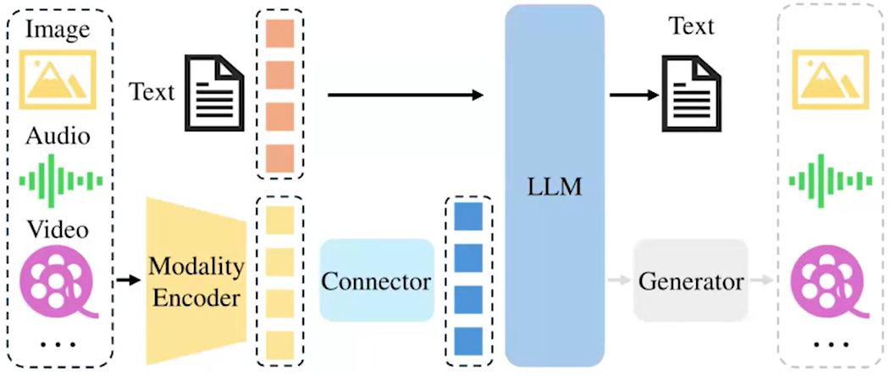](https://arxiv.org/pdf/2103.00020)

Для того, чтобы предсказывать какую-то другую модальность на выход из LLM, например картинки, нужно дополнительно выходные эмбеддинги подать в какие-то другие модели (диффузионные, генеративные), тоже самое касается для генерации аудио или видео.
Однако, что касается картинок на вход и на выход, то на данный момент это развито сильнее.


### **Encoders**

#### **CLIP: Contrastive Language-Image Pretraining**
> **Radford et al.** *"Learning Transferable Visual Models From Natural Language Supervision"*  
**ICML 2021** | [Article](https://arxiv.org/pdf/2103.00020)

На текущий момент стандартом де-факто для кодирования изображений в мультимодальных системах является модель **CLIP**.
Её ключевое преимущество заключается в том, что она обучалась на огромном массиве пар "изображение-текст", что позволяет достичь высокого уровня согласованности между визуальными и текстовыми представлениями.

[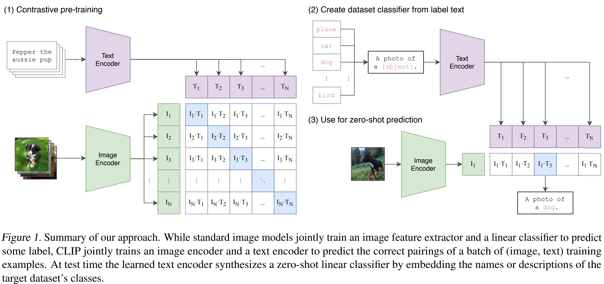](https://arxiv.org/pdf/2103.00020)

**CLIP** представляет собой симметричную архитектуру, состоящую из двух основных компонентов **Text Encoder** И **Image Encoder**

Оба компонента реализованы на основе трансформерной архитектуры и имеют схожую структуру.
В процессе работы система обрабатывает $N$ пар "изображение-текст".
Текстовый энкодер преобразует текстовые описания в соответствующие векторные представления $T_1, T_2, \dots, T_N$, в то время как визуальный энкодер аналогичным образом преобразует изображения в векторы $I_1, I_2, \dots, I_N$.

Ключевой этап обучения CLIP - сравнение полученных эмбеддингов через построение матрицы скалярных произведений.
Идеальным результатом считается ситуация, когда эта матрица приближается к единичной - то есть когда векторы, соответствующие правильным парам "изображение-текст", оказываются максимально близкими в векторном пространстве, а несоответствующие пары - максимально далёкими.

Первоначальная версия CLIP обучалась на гигантском датасете:
- 400M (image, text) - пары изображений с текстовыми описаниями
- 500 x V100 GPUs for pretraining

Однако современные методы позволяют достигать сравнимого или даже лучшего качества обучения на значительно меньших датасетах и более скромных вычислительных ресурсах.
Например, теперь для обучения подобной модели достаточно одной вычислительной ноды с 8 графическими ускорителями A100, а процесс обучения занимает около трёх дней.


##### **CLIP Softmax Loss**
Посмотрим на функцию потерь CLIP SoftMax - тут есть два слагаемых
   1) ("конкретная картинка смотрит на каждый текст")
   2) ("конкретный текст смотрит на все картинки")


Обозначим **Image Encoder**, как функцию $f(\cdot)$, а **Text Encoder** как функцию $g(\cdot)$, тогда для мини-батча $B = \{(I_1, T_1), (I_2, T_2), . . . \}$, функцию потерь можно записать как:

```math
\mathcal{L} = -\frac{1}{2|\mathcal{B}|} \sum_i^{|\mathcal{B}|} \left(
   \log\frac{e^{t\mathbf{x}_{i} \cdot \mathbf{y}_{i}}} {\sum_{j=1}^{|B|}e^{t\mathbf{x}_{i} \cdot \mathbf{y}_{j}}} + \log \frac{e^{t\mathbf{x}_{i} \cdot \mathbf{y}_{i}}} {\sum_{j=1}^{|B|}e^{t\mathbf{x}_{j}\cdot\mathbf{y}_{i}}}   
\right)
```

где:
```math
\mathbf{x}_{i}=\frac{f(I_{i})}{\|I(I_{i})\|_{2}}
```

```math
\mathbf{y}_{i}\:=\frac{g(T_{i})}{\|\bar{u}(I_{i})\|_{2}}
```

**Проблемы**:
- У SoftMax, есть некоторая вычислительная сложность нормализации, когда нужно аккуратно контролировать значение нормализующего делителя на всех нодах.
- Ограничения памяти для больших батчей, т.к. нужно помнить всю большую матрицу для батча (который может содержать несколько тысяч пар (image, text)).

##### **Sigmoid Loss (SigLIP)**
> **Zhai et al.** *"Sigmoid Loss for Language Image Pre-Training"*  
**ICCV 2023** | [Article](https://arxiv.org/pdf/2303.15343)

Модицифакия оригинального Loss-а, по сути здесь осуществляется переход от SoftMax (многоклассовой классификации), к Sigmoid (бинарной классификации), т.е соответствует ли данной картинке конкретный текст или не соответствует (теперь на соседние текста, мы не смотрим и не делаем никакую нормализацию в вектор вероятностей).

```math
\mathcal{L} = -\sum_{i=1}^{\mathcal{|B|}} \sum_{j=1}^{\mathcal{|B|}} \mathcal{L}_{ij}
```

```math
\mathcal{L}_{ij} = \log \frac{1}{1 + e^{z_{ij} (-t\mathbf{x}_{i} \cdot \mathbf{y}_{i} + b)}}
```

**Преимущества**:
- Устранение необходимости глобальной нормализации, т.к больше не требуется материальзовать в памяти всю матрицу для батча.
- Возможность работы с бо́льшими батчами
- Эффективность распределённых вычислений

Если подвести заключение, то на данный момент, как правило в качестве **Image Encoder** используют либо **CLIP**, либо **SigLIP**, в преобладающем большинстве работ.

При этом стоит понимать, что от архитектуры **CLIP/SigLIP** используется только **Image Encoder**, а родной **Text Encoder** не используется, потому что он уже неявным образом уже представлен в самой LLM. Как раз поэтому, этап allignment-а, картиночных токенов с самой LLM, нужно делать.


### **Обработка изображений высокого разрешения**
> **Liu et al.** *"Improved Baselines with Visual Instruction Tuning"*  
**CVPR 2024** | [Article](https://arxiv.org/pdf/2310.03744)


> <details>
> <summary><b>Liu et al., 2024</b> ― <i>«Improved Baselines with Visual Instruction Tuning»</i></summary>
> 
> - 🎯 **Venue**: CVPR 2024 (Core A*)  
> - 📜 **Paper**: [arXiv PDF](https://arxiv.org/pdf/2310.03744)  
> - 🏆 **Citations**: 287 (as of 2025)  
> - ✨ **Key innovations**: 
>   - Unified visual instruction tuning framework
>   - +12.7% on ScienceQA benchmark
>   - 3× faster convergence
> - 🔍 **Notable**: Establishes new SOTA for 7B-parameter MLLMs
> </details>

При работе с мультимодальными моделями особую сложность представляет обработка изображений высокого разрешения, особенно в контексте задач, требующих анализа мелких деталей (например, распознавание текста на изображении).

**Проблематика:**
Стандартные визуальные энкодеры (например, **CLIP** с типичным разрешением 336×336 пикселей) при уменьшении разрешения входного изображения теряют критически важные детали, что неизбежно снижает качество ответов модели на вопросы, требующие анализа мелкомасштабных элементов.

#### **Slicing and Dual-branch**
[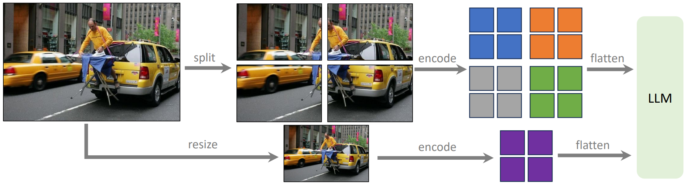](https://arxiv.org/pdf/2103.00020)
*Рис. 2: Архитектура LLaVA-1.5-HD для обработки высоких разрешений. Изображение разделяется на сетку независимо кодируемых патчей, что позволяет, масштабироваться на произвольные разрешения без интерполяции позиционных эмбеддингов ViT, и сохранять глобальный контекст через конкатенацию фичей даунсэмплированной версии изображения (Адаптировано из Liu et al., 2024)*


1. **Метод срезов (Slicing)**  
   - Изображение разделяется на перекрывающиеся патчи (с возможным overlap)  
   - Каждый патч независимо обрабатывается визуальным энкодером (например, CLIP)  
   - Перекрытие патчей позволяет:  
     ∙ Сохранять контекст на границах срезов  
     ∙ Уменьшать потерю информации между сегментами  
     ∙ Повышать стабильность распознавания объектов, пересекающих границы патчей

2. **Двухветвевая архитектура (Dual-Branch)**  
   - **Низкоразрешающая ветвь:**  
     ∙ Обрабатывает downsample-версию изображения  
     ∙ Извлекает глобальный контекст и высокоуровневые признаки  
   - **Высокоразрешающая ветвь:**  
     ∙ Анализирует оригинальное/увеличенное разрешение  
     ∙ Фокусируется на локальных деталях  
   - Альтернативой может быть пирамида разрешений, но на практике чаще используют две ветви как оптимальный баланс между качеством и вычислительной сложностью

В отличие от традиционных CNN-архитектур, **Vision Transformer (ViT)** не обладает встроенной пирамидой признаков (feature pyramid), что ограничивает его способность к эффективной агрегации информации на разных масштабах. Это объясняет, почему текущий SOTA в CV (по крайней мере сейчас) - **Swin Transformer**, использующий иерархическую структуру с локальными окнами вычислений.

Несмотря на указанные ограничения, большинство мультимодальных моделей используют **CLIP-based энкодеры** (обычно ViT-архитектуры), имеющих плоскую структуру без иерархии признаков.


#### **Semantic Future Pyramid**
> **Zhang et al.** *"LLaVA-UHD v2: an MLLM Integrating High-Resolution Semantic Pyramid via Hierarchical Window Transformer"*
**arXiv 2024 (v2 — 19 Mar 2025)** | [Article](https://arxiv.org/pdf/2310.03744) | [Code](https://github.com/thunlp/LLaVA-UHD)


[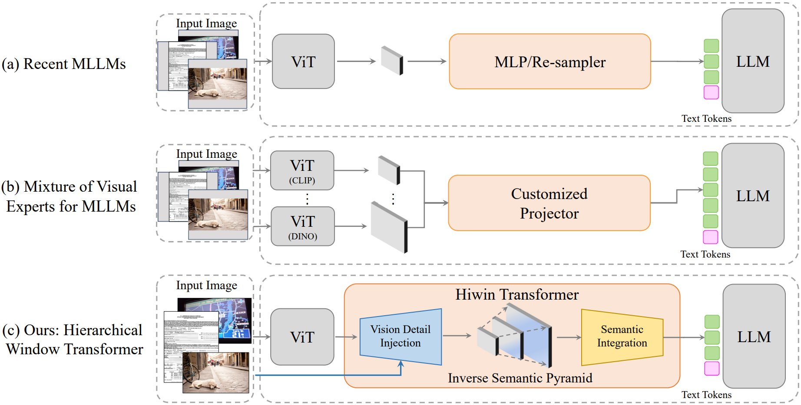](https://arxiv.org/pdf/2412.13871)  
*Рис. 3: Сравнение **LLaVA-UHD v2** с другими MLLMs: (a) Типичные MLLM: выравнивание признаков **ViT** в языковое пространство через **MLPs** или **Perceiver Re-samplers**, что ограничивает визуальную детализацию. (b) Комбинация нескольких визуальных энкодеров: неуниверсальный и ресурсоемкий подход. (c) **LLaVA-UHD v2**: использует **Hiwin-Transformer** для построения инвертированной семантической пирамиды с последующей компрессией в визуальные токены, обеспечивая различную семантическую детализацию для генерации языка.*  

1. **Постобработка ViT-фичей**:
   - Добавление пирамидального агрегатора поверх стандартного **ViT**
   - Фактическое создание аналога **Swin-Transformer** через:
     ∙ Многоуровневую группировку патчей
     ∙ Прогрессивное объединение признаков

2. **Архитектура LLaVA-UHD-v2**:
[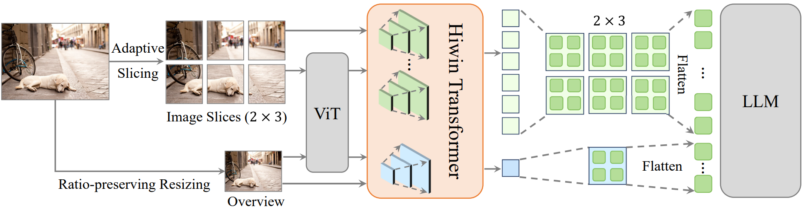](https://arxiv.org/pdf/2412.13871)  
> *Рис. 15: Общая архитектура **LLaVA-UHD v2**. Cостоит из **ViT Encoder**, Hierarchical window transformer (**Hiwin**) и **LLM**. Cначала **Hiwin** добавляет высокочастотные визуальные детали в высокоуровневую семантику в **ViT** features. (формирование inverse semantic pyramids - ISP). После этого он сжимает пирымиды ISPs в пространственно-согласованные токены с помощью межмасштабных окон (cross-scale windows) для улучшенного визуально языкового согласования (vision-language alignment)*


### **Альтернативный подход к обработке высоких разрешений: архитектура Fuyu/Otter**
> **Bavishi et al.** *"Fuyu-8B: A Multimodal Architecture for AI Agents"*  
**Adept AI, 2023** | [Article](https://www.adept.ai/blog/fuyu-8b) | [Hugging Face](https://huggingface.co/adept/fuyu-8b)

> **Li et al.** *"OtterHD: A High-Resolution Multi-modality Model"*  
**ArXiv 2024** | [Article](https://arxiv.org/pdf/2311.04219) | [Code](https://github.com/EvolvingLMMs-Lab/Otter)

Ещё один достаточно экзотичный подход к обработки высоких разрешений, который стоит упомянуть.
Ключевая идея в том, что делается **"прямое внедрение**" (**direct injection**), картиночных токенов прям в декодер трансформера (инициализируется он как раз из весов уже готовой **LLM**), т.е:
- Изображения и текст обрабатываются единым трансформерным декодером
- Визуальные патчи проецируются в пространство токенов аналогично текстовым

[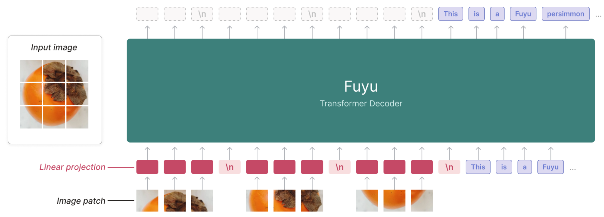](https://www.adept.ai/blog/fuyu-8b)  
> *Рис. 16: Схема архитектуры модели **Fuyu**. **Fuyu** это ванильный декодер трансформера, без какого-либо специального картиночного энкодера. В **Fuyu** визуальные патчи напрямую проецируются в первый слой LLM, минуя отдельный vision-энкодер*

1. **Процессинг изображений:**
   - Разбиение на патчи стандартного размера (напр. 16×16 пикселей)
   - Линейная проекция в скрытое пространство LLM
   - Специальный токен `image-newline` для маркировки строк
   - Отказ от позиционных эмбеддингов для поддержки произвольных разрешений

2. **Преимущества:**
   - Упрощенный пайплайн обучения (отсутствие отдельных фаз для разных разрешений)
   - Поддержка произвольных аспектных соотношений без паддинга
   - Единый механизм обработки мультимодальных данных

3. **Эволюция в OtterHD:**
   - Сохранение базовой архитектуры Fuyu
   - Оптимизация для высоких разрешений через:
     - Улучшенный механизм внимания к деталям
     - Специализированный бенчмарк MagnifierBench[citation:OtterHD]

Получается такой более прямолинейный подход, однако, качество у него будет похуже, потому что некоторые знания о том как лучше обрабатывать изображения, модели не используют. Но при бесконечных вычислительных ресурсах и данных, такая стратегия абсолютно валидная, просто обучаем "до посинения". На больших масштабах, априорные знания и специфичные энкодеры будут играть не такую значительную роль.


### **Mixture of Encoders (MoE)**
> <details>  
> <summary><b>Shi et al., 2025</b> ― <i>«Eagle: Exploring The Design Space for Multimodal LLMs with Mixture of Encoders»</i></summary>  
>  
> - 🎯 **Venue**: ICLR 2025  
> - 📜 **Article**: [arXiv PDF](https://arxiv.org/pdf/2310.03744)  
> - 💻 **Code**: [GitHub](https://github.com/NVlabs/Eagle)  
> </details>  

**Идея**: Расширение CLIP за счет добавления специализированных визуальных энкодеров (*Vision Experts*), для решения более узкоспециализированных задач (*Object Detection*, *Text Recognition*, *Segmentation* и другие).  

**Проблема**: Признаки от разных энкодеров имеют различное пространственное разрешение. Как эффективно их объединить?

В работе **Eagle (NVidia, 2025)** систематически исследуются методы агрегации мультимодальных признаков: 

[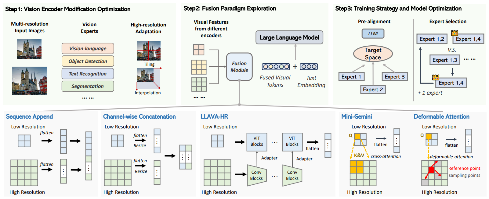](https://arxiv.org/pdf/2408.15998)  
> *Рис. 17: Сравнение парадигм fusion в Eagle. Исследуются подходы к интеграции признаков от множества визуальных энкодеров.*  

**Основные подходы к fusion**:  
1. **Sequence Append**  
   - **Принцип**: Конкатенация токенов от всех энкодеров в единую более длинную последовательность.  
   - **Плюсы**: Простота реализации.  
   - **Минусы**: Рост вычислительных затрат из-за увеличения контекста (особенно для высоких разрешений).  

2. **Channel-wise Concatenation**  
   - **Принцип**: Апскейл низкоразмерных признаков до общего разрешения и объединение токенов по канальному измерению, без увеличения длины последовательности
   - **Плюсы**: Сохраняет spatial-структуру; дешевле Sequence Append. Линейные слои эффективно агрегируют информацию; умеренные требования к памяти.  

3. **LLaVA-HR**  
   - **Принцип**: Обогащение низкоразмерных признаков через *Cross-Attention* с высокоразмерными (аналогично ViT-блокам). Внедрение высокоразрешающих признаков в низкоразрешающий энкодер через **Mixture-of-Resolution Adapter** (адаптер смешения разрешений).
   - **Особенность**: Использует запросы (*Q*) к низкому разрешению, но значения (*V*) берутся из высокого.  

4. **Mini-Gemini**  
   - **Принцип**: CLIP-токены выступают как запросы (Q) с низкого разрешения, для кросс-аттеншена к высокому разрешению других вжн энкодеров, в локальных соответствующих окнах.

5. **Deformable Attention** *(новый базлайн в Eagle)*  
   - **Улучшение Mini-Gemini**: Замена стандартного window-аттеншена на *деформируемый* (DA).  
   - **Преимущества**:  
     - Динамический выбор релевантных областей внимания (не только жесткие окна).
     - Лучше адаптируется к объектам произвольной формы.


Авторы в статье **Eagle** провели систематическую оценку fusion методов, используя: 
   - **LLM**: Модель 7B параметров (базовый вариант).  
   - **Визуальные энкодеры**: Комбинация из:  
     - **CLIP** (общее понимание изображения, аналог "мешка слов"),  
     - **ConvNeXt** (пространственные зависимости, сверточная архитектура),  
     - **SAM** (Segment Anything Model, для сегментации).

[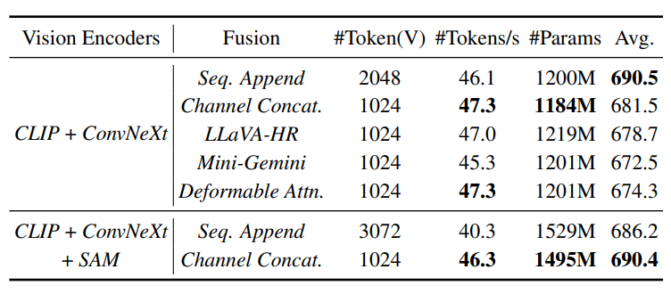](https://arxiv.org/pdf/2408.15998)  
> *Рис. 18: Сравнение различных fusion методов, для разных вижн экспертов. “#Token(V)” обозначает количество визуальных токенов. “#Tokens/s” обозначает скорость инференса токенов, через весь пайплайн.*

Если посмотреть на эффективность и на метрики, то видно, что лучше всего себя показали, удлинение контекста (**Sequence Append**) либо поканальная конкатенация (**Channel-wise Concatenation**).

В целом стоит отметить, что при наличии большого количества данных, простые дизайны и подходы хорошо срабатывают и являются более предпочтительными.


### **Mixture-of-Vision-expert Adapter (MoVA)** 
> <details>  
> <summary><b>Zong et al., 2024</b> ― <i>«MoVA: Adapting Mixture of Vision Experts to Multimodal Context»</i></summary>  
>  
> - 🎯 **Venue**: NeurIPS 2024  
> - 📜 **Article**: [arXiv PDF](https://arxiv.org/pdf/2404.13046)  
> </details>  

**Проблема**
До этого говорилось, о том как учитывать все признаки со всех энкодеров сразу, а что если у нас энкодеров довольно много? Использование множества специализированных визуальных энкодеров (например, 8 моделей для детекции, сегментации, OCR и т.д.) приводит к:  
- **Высоким вычислительным затратам**: Инференс замедляется пропорционально числу моделей (в 8 раз для 8 энкодеров).  
- **Избыточности**: Не все эксперты нужны для каждой задачи (см. *Рис. 19*).  

[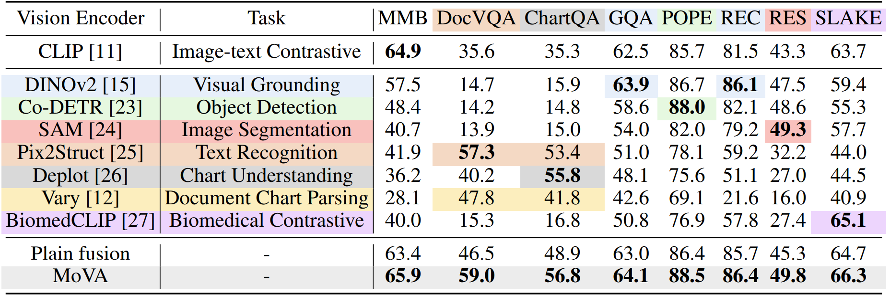](https://arxiv.org/pdf/2404.13046)
> *Рис. 19:  Сравнение **CLIP** vs state-of-the-art узкоспециализированных энкодеров. **CLIP** показывает конкурентоспособные результаты, но task-specific модели (например, для распознавания текста) могут давать значительный прирост на целевых задачах. (Используются одни и те же данные для каждой модели.)*

**Решение: Динамический роутинг экспертов**  
Ключевая идея **MoVA** - "Не запускать все энкодеры сразу, а выбирать 1-2 релевантных для конкретного запроса"  

#### **Архитектура**  
1. **Роутер (LLM)**:  
   - **Вход**: Изображение (через базовый **CLIP** + Downsampling) + текстовый запрос.  
   - **Механизм**:  
     - Описание всех доступных экспертов (их специализация, метрики) зашито в **системный промпт**.  
     - LLM анализирует запрос и выбирает подходящие энкодеры (*пример промпта — Рис. 21*).  

2. **MoV-Adapter**:  
   - Агрегирует признаки от выбранных экспертов в фиксированный набор токенов.  
   - **Важно**: Требует предварительного обучения (но не переобучается при добавлении новых экспертов).  

[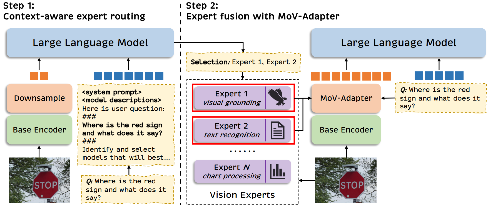](https://arxiv.org/pdf/2404.13046)
> *Рис. 20: Pipeline MoVA. Роутинг на основе мультимодального контекста с последующим адаптивным fusion.*

#### **Пример работы**  
**Промпт роутера**:  
```markdown
Доступные эксперты:  
1. **SAM** — сегментация объектов.  
2. **PP-OCR** — распознавание текста.  
3. **ConvNeXt-UNet** — детекция медицинских аномалий.  

Запрос: "Какие товары на полке имеют ценники со скидкой?"  
Рекомендуемые эксперты: [1, 2]  
```  

[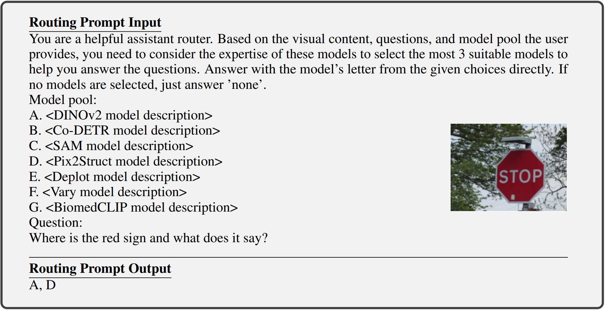](https://arxiv.org/pdf/2404.13046)
> *Рис. 21: Пример текстового промпта для выбора экспертов. LLM анализирует задачу и контекст. В верхнем блоке представлены мультимодальные входные данные, а в нижнем - языковой ответ.*

#### **Преимущества**
- **Гибкость**: Добавление новых экспертов требует только обновления промпта (без изменения архитектуры).  
- **Эффективность**: Снижение вычислений в 4-8 раз по сравнению с "включением всех" энкодеров.  
- **Интерпретируемость**: Логика выбора экспертов прозрачна (через текстовые объяснения LLM).  

**Ограничения**:  
- Задержка из-за двухэтапного процесса (роутинг → инференс).  
- Требует тонкой настройки адаптера для новых задач.  

---
#### **MoV-Adapter** 
Стоит упомянуть, что **MoV-Adapter** - некоторый маленький трансформер для унификации выходов различных Vision Experts в фиксированный набор токенов для LLM.

**Архитектура (Рис. 23)**:  
- Небольшой **трансформер** с обучаемыми параметрами:
  - 🔹 **Запросные токены** (learnable queries): Фиксированное число (напр., 64)
  - 🔹 **Cross-Attention**: Агрегирует информацию из произвольного числа токенов экспертов
  - 🔹 **Выход**: Стандартизированные токены для LLM

[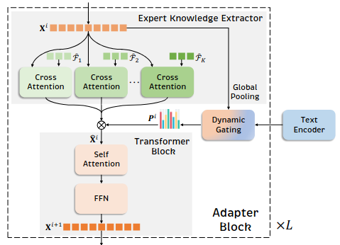](https://arxiv.org/pdf/2404.13046)
> *Рис. 23: MoV-Adapter использует механизм внимания для "сжатия" признаков от произвольного числа экспертов в фиксированный формат.*

#### **Двухэтапное обучение**
[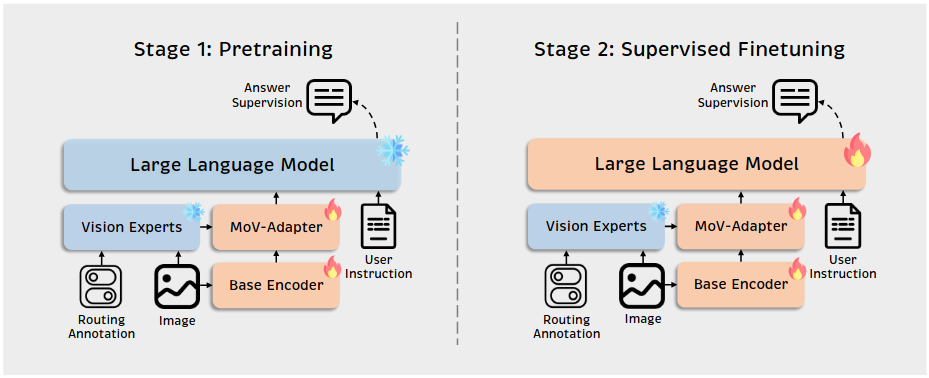](https://arxiv.org/pdf/2404.13046)
> *Рис. 22: Поэтапное обучение MoVA. Важно: эксперты никогда не обновляются — сохраняется их специализированное качество.*

**Этап 1**: Подготовка адаптера  
- ❄️ **Заморожены**: LLM, Vision Experts  
- 🔥 **Обучаются**:  
  - MoV-Adapter  
  - Base Encoder (CLIP)  
- **Цель**: Научиться извлекать релевантные признаки из task-specific моделей  

**Этап 2**: Тонкая настройка  
- ❄️ **Заморожены**: Vision Experts  
- 🔥 **Обучаются**:  
  - LLM  
  - MoV-Adapter (дополнительная подстройка)


##### Сравнение с Eagle  
| Критерий       | Eagle (NVidia)               | MoVA                        |  
|----------------|-----------------------------|----------------------------|  
| **Стратегия**  | Фиксированный fusion         | **Адаптивный** выбор экспертов |  
| **Гибкость**   | Требует пересборки           | Hot-swap экспертов через промпт |   
| **Оптима для** | Максимальная точность        | Ресурсоэффективные сценарии |
| **Инференс**   | Все эксперты → Heavy         | 1-2 эксперта → Легче       |  

**Вывод**: **MoVA** предлагает компромисс между производительностью и точностью, особенно актуальный для онлайн-сервисов.


### **Context Compression: Matryoshka Query Transformer (MQT)**
> <details>  
> <summary><b>Hu et al., 2024</b> ― <i>«Matryoshka Query Transformer for Large Vision-Language Models»</i></summary>  
>  
> - 🎯 **Venue**: NeurIPS 2024  
> - 📜 **Article**: [arXiv PDF](https://arxiv.org/pdf/2405.19315)
> - 💻 **Code**: [GitHub](https://github.com/gordonhu608/MQT-LLaVA)
> </details>

**Ключевая идея**
Допустим есть **Vision Encoder**, который выдает какое-то количество своих признаков (токенов), каким образом можно это количество динамически уменьшить и меть возможность быстро переключаться? да при этом нужно это количество токенов уменьшить. Авторы предлагаю использовать управлемок количество визуальных токенов (Elastic Visual Tokens) (от 2 до 256) с сохранением информативности — подобно матрёшке, где каждый уровень вложенности добавляет детализацию.

[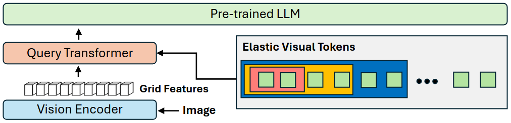](https://arxiv.org/pdf/2405.19315)
> *Рис. 24: Query Transformer кодирует изображение в иерархические токены. Во время обучения случайно выбирается m токенов (2 ≤ m ≤ 256), на инференсе — гибкий выбор любого m.*


#### **Принцип работы**
1. **Иерархические токены**:
   - Нужно получить токены запросы, которыу будут вкладываться другу в друга как матрешки. Стартуют с двух токенов (они будут нести основую информацию про изображение), дальше можно добавить ещё парочку (т.е уже станет 4) -> детайлей станет больше. Чем-то это напоминает метод главных компонент, только все обучается.
     - Базовые (2-4 токена): глобальная информация об изображении
     - Средние (16-64): ключевые объекты
     - Детальные (128-256): локальные детали

2. **Механизм Cross-Attention**:
   - Обучаемые запросы (queries) последовательно обогащаются признаками из Vision Encoder
   - Аналог PCA, но с обучением иерархии признаков

На этапе обучения количество токенов, подаваемое в трансформер случайно варьируется (2 - 256 токенов), но в среднем модель будет видеть 128 токенов.

#### **Результаты**
[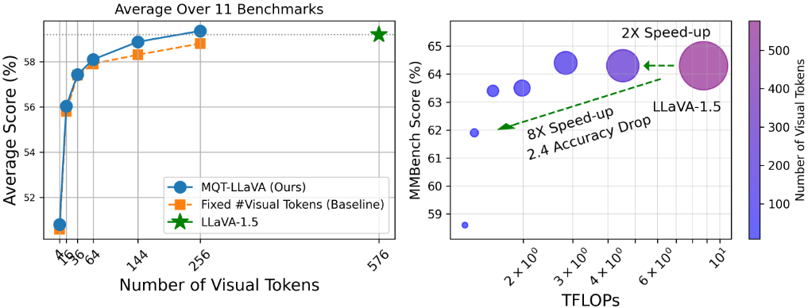](https://arxiv.org/pdf/2405.19315)
> *Рис. 25: MQT-LLaVA сохраняет точность LLaVA-1.5 при 256 токенах (2× ускорение), даёт 8× ускорение при 16 токенах (просадка всего 2.4%).*


[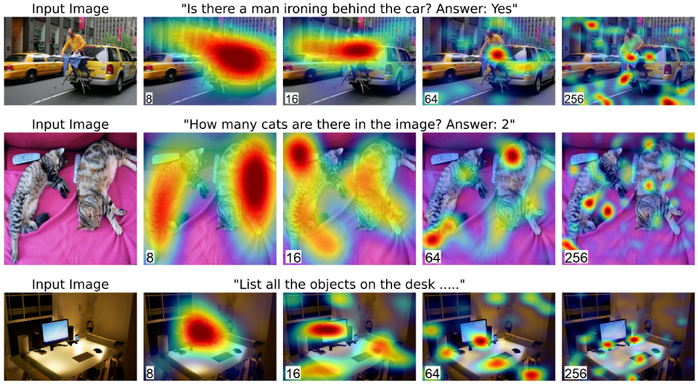](https://arxiv.org/pdf/2405.19315)
> *Рис. 26: Grad-CAM визуализация для разного числа токенов. Меньше токенов → фокус на high-level концептах (8 токенов), больше → детализация (256 токенов).*


### **Connector: интерфейс между визуальными и языковыми моделями**

> **Назначение**:  
> Преобразование визуальных признаков (от Vision Encoder) в формат, понятный Large Language Model (LLM), сохраняя семантическую связность.

#### **Типы Connector'ов**

- **MLP-based (Multi-Layer Perceptron)** - обычно 1-2 линейных слоя (+ активация, например, GeLU.

- **Q-Former (Query Transformer)** - Небольшой трансформер с обучаемыми query-токенами (например, 32 токена). которые обогащаются vision токенами, через механизм Cross-Attention.  

- **XAttention LLM (Cross-Attention Integration)** - Визуальные токены (изначально инициализирутся нулевыми) подмешиваются в слои LLM на разной глубине через **гейтинг-механизм**.

[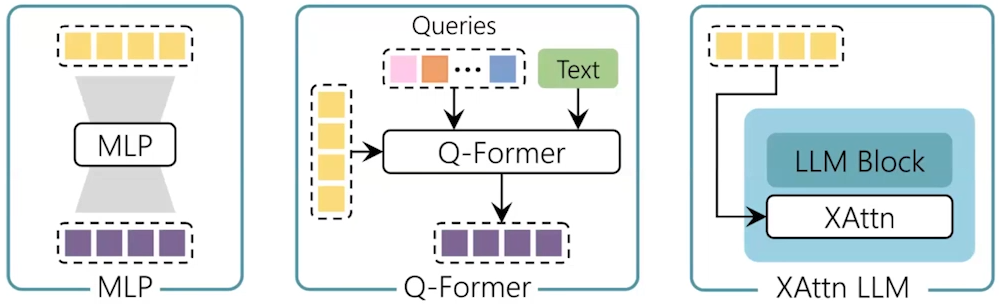](https://arxiv.org/pdf/2405.19315)
> *Рис. 27: Сравнение архитектур Connector'ов.*

---

## **5. Обзор нескольких популярных моделей**
### **5.1 Large Language and Vision Assistant (LLaVA)**
> <details>  
> <summary><b>Liu et al., 2024</b> ― <i>«Visual Instruction Tuning»</i></summary>  
>  
> - 🎯 **Venue**: NeurIPS 2023 
> - 📜 **Article**: [arXiv PDF](https://arxiv.org/pdf/2304.08485)
> - 💻 **Code**: [GitHub](https://github.com/haotian-liu/LLaVA)
> - 🌐 **Site**: https://llava-vl.github.io/
> </details>


Начнем с базой модели это LLaVA. Работает следующим образом: есть LLM - Vicuna 7B
Vision Encoder - CLIP ViT-L/14
Connector(Projection) - Linear (MLP)
#### **Архитектура LLaVA**

**Ключевые компоненты**:
- **Языковая модель**: Vicuna (7B параметров)
- **Визуальный энкодер**: CLIP ViT-L/14
- **Коннектор**: Линейный слой (MLP)

[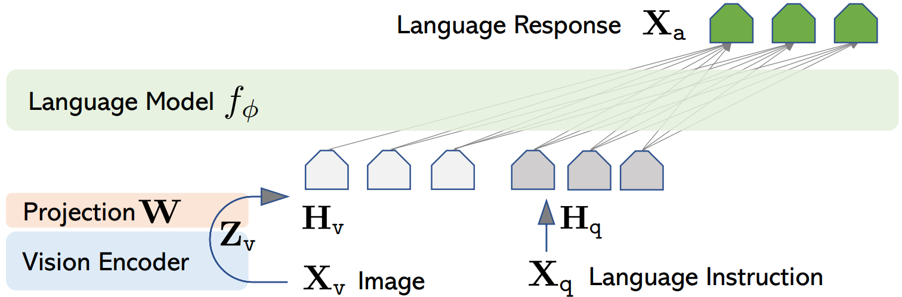](https://arxiv.org/pdf/2304.08485)
> *Рис. 28: Архитектура LLaVA. Визуальные признаки проецируются в пространство языковой модели через линейный слой.*

**Процесс обработки**:
1. Извлечение признаков: CLIP обрабатывает изображение (фиксированное разрешение 336×336)
2. Проекция: Линейный слой преобразует визуальные токены
3. Конкатенация: Объединение с текстовыми токенами
4. Генерация: Языковая модель формирует ответ


#### **Обучение в два этапа**

1. **Pretraining**:
   - ❄️ Заморожены: Языковая модель, Vision Encoder
   - 🔥 Обучается: Только проекционный слой (MLP)
   - **Цель**: Научить модель "понимать" визуальные признаки

2. **Fine tuning**:
   - ❄️ Заморожен: Vision Encoder
   - 🔥 Обучаются: Проекционный слой + языковая модель
   - **Данные**: Инструктивные данные (instruction-following)

#### **Генерация обучающих данных**

**Проблема**: Академические датасеты содержат короткие и формальные вопросы/ответы, не отражающие реальное общение.

**Решение LLaVA**:  
Использование GPT для генерации синтетических инструктивных данных:
1. Исходные данные: Изображения с разметкой (bbox) + текстовое описание
2. Генерация:
   - GPT создает разнообразные вопросы (от простых до детализированных)
   - GPT формулирует развернутые ответы
3. Результат: Набор данных, имитирующий человеческое общение

[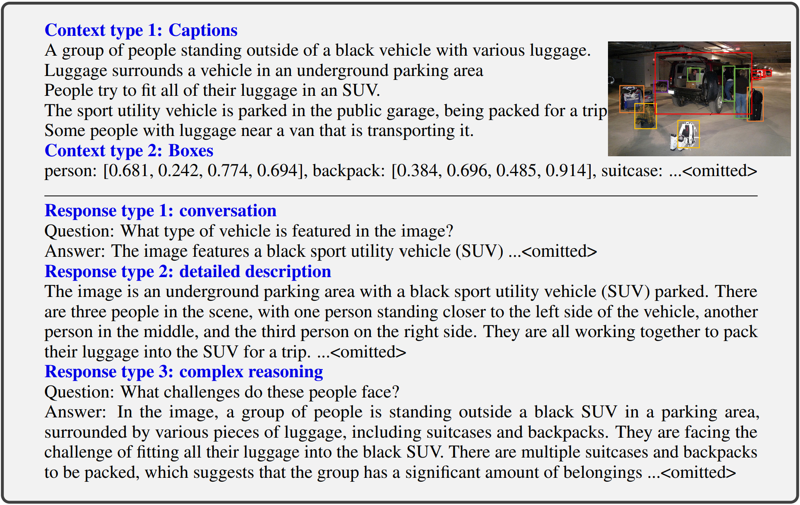](https://arxiv.org/pdf/2304.08485)
> *Рис. 29: Процесс создания инструктивных данных. GPT генерирует вопросы и ответы на основе текстового описания изображения.*


### Molmo and PixMo
> <details>  
> <summary><b>Deitke et al., 2024</b> ― <i>«Molmo and PixMo: Open Weights and Open Data for State-of-the-Art Vision-Language Models»</i></summary>  
>  
> - 🎯 **Venue**: NeurIPS 2023 
> - 📜 **Article**: [arXiv PDF](https://arxiv.org/pdf/2409.17146)
> - 🌐 **Site**: https://allenai.org/blog/molmo
> </details>


#### Архитектура и обучение  
Модель следует подходу LLaVA, используя:  
- **Визуальный энкодер**: CLIP ViT-L/14 (336px) с обработкой высокого разрешения через overlapping slicing (нарезку с перекрытием).  
- **Языковую модель**: различные открытые LLM.  

**Двухэтапное обучение модели целиком (без заморозки параметров)**:  
1. **Pretraining** на датасете PixMo (instruction data), чтобы модель была больше похожа на чатбота.  
2. **Fine-tuning** на комбинации PixMo и академических датасетов.  
Цель: сначала адаптировать модель к диалоговому формату, затем повысить точность в специализированных задачах.

**Ключевая особенность**: поддержка **grounding** через аннотации в формате XML. Модель обучается указывать на объекты в изображении с координатами и описаниями, например:  
```xml 
<point x="63.5" y="44.5" alt="MtRainer">Mt Rainer</point>
```


#### **PixMo (Pixelf for Molmo): Стратегия сбора данных**
Авторы предлагают инновационный метод аннотирования изображений, устраняющий недостатки ручного описания (медленная скорость, риск использования GPT разметчиками). Авторы заметили, что людям печатать тяжело, а вот сделать голосовое сообщение намного проще - они просили людей просто описать голосовым сообщением (60 или 90 секунд) картинку.

**Процесс создания датасета**:  
1. **Голосовые описания**:  
   - 3 аннотатора описывают изображение в течение 60–90 секунд.  
   - Транскрибированный текст улучшается с помощью LLM.  
   *Преимущества*:  
   - Более детализированные описания vs. текстовый ввод. Голосом люди описывали картинку значительно подробнее.
   - Верификация авторства (уникальность голоса).  

2. **Instruction Data**:  
   - К изображению добавляется голосовая транскрипция.  
   - Аннотатор формулирует вопрос, который затем оптимизируется LLM.  
   - Ответ генерируется текстовой LLM на основе описания и уточняется человеком.  

3. **Pointing-аннотации**:  
   - Разметчики указывают на объекты в изображении.  
   - Дополняется синтетическими данными от CV-детекторов (Object Detectors).


[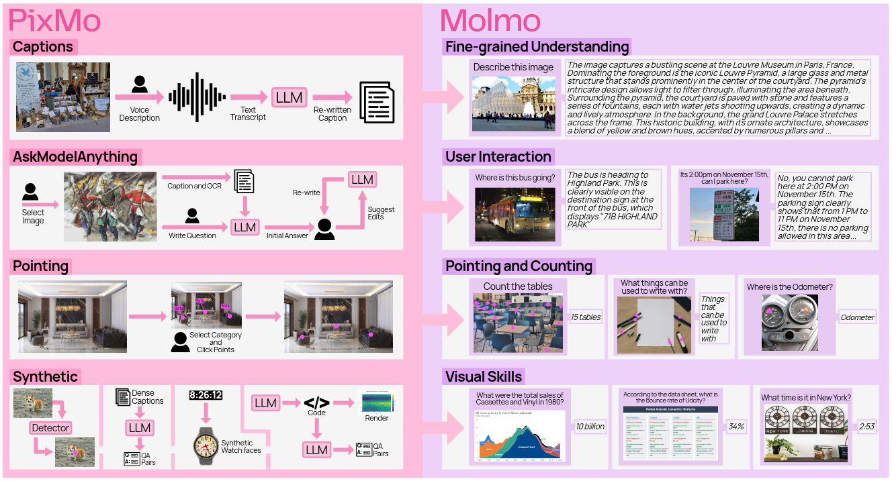](https://arxiv.org/pdf/2409.17146)
> *Рис. 30: Датасеты **PixMo** (слева) и возможности которые они предоставляют в **MolMo** (справа). PixMo состоит из трех аннотированных наборов данных и четырех синтетических наборов данных, созданных без использования VLMs. Аннотированные наборы данных включают в себя: подробные подписи (pretraining), instruction data (fine-tunning) и pointing (fine-tuning, to support grounding and counting)). Четыре синтетических набора данных дополняют эти наборы данных, ориентируясь на дополнительные навыки (например, чтение по часам, понимание документов).*

**Аннотированные данные**:  
1. **PixMo-Cap** (Pretraining):  
   - 712k изображений, 1.3M описаний.  
   - Этапы: голос → транскрипция → улучшение LLM → суммаризация.  

2. **PixMo-AskModelAnything** (Fine-tuning):  
   - 73k изображений, 162k пар вопрос-ответ.  
   - Полуавтоматическая генерация вопросов с помощью LLM.  

3. **PixMo-Points** (Fine-tuning для grounding):  
   - 428k изображений, 2.3M пар вопрос-точка.  
   - Дополнено 29k изображений с 79k QA-парами.  

**Синтетические данные**:  
- **PixMo-CapQA**, **PixMo-Docs**, **PixMo-Clocks** (генерация через LLM).  
- Фокусируются на узких навыках: чтение часов, анализ документов.


#### Открытость MolMo и сравнительный анализ
Авторы статьи, рассуждают над вопросом, "Что такое открытая модель?". Поскольку у нас есть и Vision Encoder и LLM, ньюансов что такое открытая модель может быть много. Авторы предлагают систематическую классификацию открытости моделей, учитывая:  
1. **Компоненты модели**:  
   - Vision Encoder 
   - LLM Backbone
   - Полная VLM-архитектура
2. **Атрибуты открытости**:  
   - **Открытые веса**  
   - **Открытый код обучения**  
   - **Открытые данные**  

**Ключевые наблюдения**:  
- Модели типа Qwen (Китай) предоставляют ограниченную информацию (например, веса без данных).  
- API-решения (GPT-4V, Gemini) полностью закрыты.  
- **Molmo** — единственная модель с **полной открытостью** по всем критериям (см. Рис. 31):  
  - Веса и код VLM, LLM (OLMo), Vision Encoder (CLIP) доступны.  
  - Данные PixMo опубликованы (кроме синтетических subset’ов).

[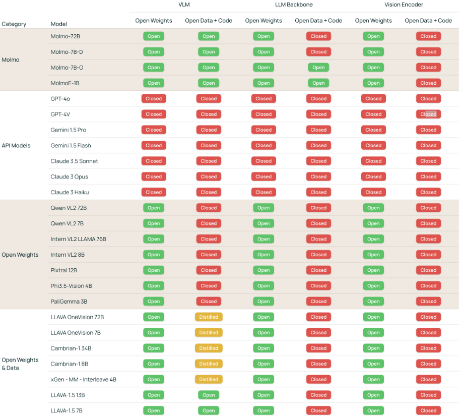](https://arxiv.org/pdf/2409.17146)
> *Рис. 31: Сравнение открытости **VLM**. Открытость VLM характеризуется на основе двух атрибутов (открытые веса, открытые данные и код) в трех компонентах модели (непосредственно **VLM** и два предобученных компонента, **LLM Backbone** и **Vision Encoder**). В дополнение к ”open”/"closed", используется метка ”distilled”, чтобы указать, что данные, используемые для обучения VLM, включают изображения и текст, сгенерированные другим, проприетарным **VLM**, что означает, что модель не может быть воспроизведена независимо от него.*

#### MolMo evaluation
**Результаты бенчмарков** (на сентябрь 2024):  
1. **MolmoE 1B** приближается к GPT-4V.  
2. **Molmo 7B-D/O** занимают промежуточное положение между GPT-4V и GPT-4o.  
3. **Molmo 72B** демонстрирует качество на уровне GPT-4o:  
   - Превышает Gemini 1.5 и Claude 3.5 Sonnet.  

[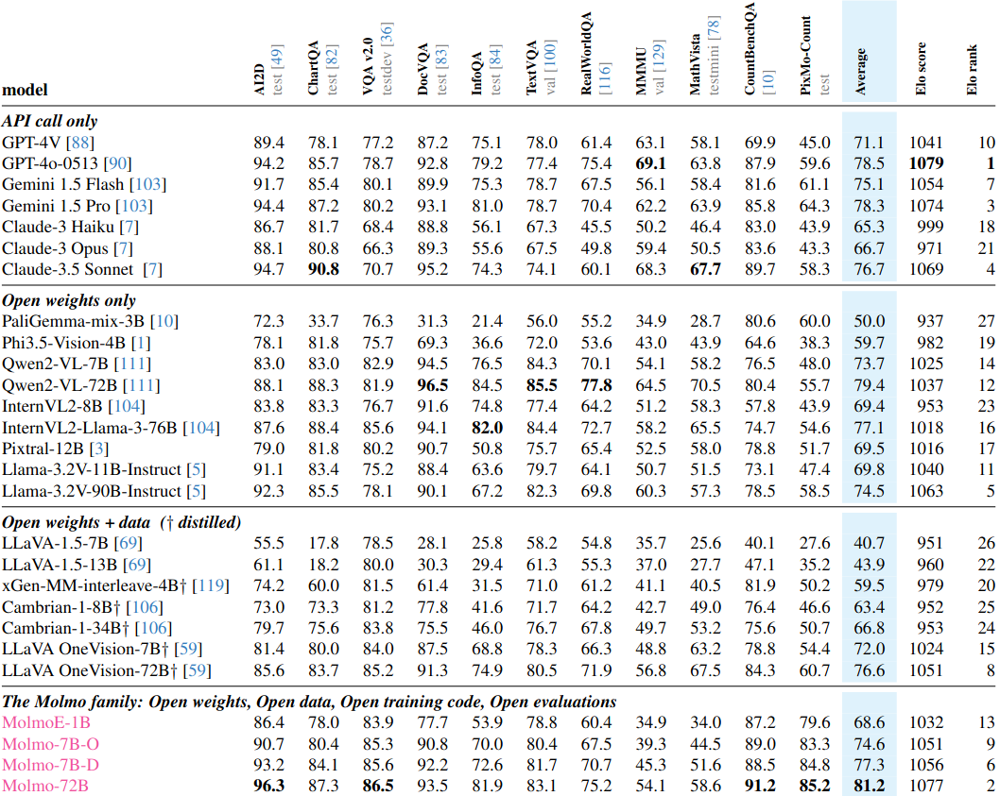](https://arxiv.org/pdf/2409.17146)
> *Рис. 32: Результаты Бенчмарков **VLM**.*

**Важные нюансы**:
- Данные актуальны на момент публикации (NeurIPS 2023); текущие версии коммерческих моделей могут изменить соотношение сил.
- Среди **открытых** моделей Molmo остается одним из лидеров по сочетанию открытости и качества.


### QWen2.5-VL
Модель с одной стороны хорошо выложена, хорошо работает но тех репорт не такой подробный. Арихтектура похожая на LLaVa- при этом они переработали **Vision Encoder** - они его заново обучают, (есть некоторые технические ньюансы он у них немного по другому выглядит). Далее - у них есть нарезка на слайсинг и приведение к фиксированному разрешению, они ещё умеют обрабатывать видео. После того как все процесситься через **ViT**, используется MLP с двумя слоями и все подается в QWen LLM. При это они не пишут ничего про данные кроме того какие категории используются,  