# [ШАД] Лекция 1: Intro to MLLMs. Image Modality


---
> **MLLMs** (Multimodal Large Language Models) — модели, работающие с несколькими модальностями (текст + изображение/аудио/видео).


## 1. MLLMs как шаг к AGI
**MLLMs** - естественный этап развития искусственного интеллекта в сторону **AGI**. Их создание основано на гипотезе, что обработка множества модальностей приближает модели к человеческому мышлению.

### 🔍 Основные аспекты
1. **Сенсорная интеграция (Sensor Fusion)**  
   Объединение данных разных типов (текст, изображения и др.) позволяет моделям воспринимать информацию комплексно, как это делает человек.

2. **Использование знаний LLM**  
   Языковые модели служат универсальной базой знаний о мире. Добавление других модальностей (например, визуальной) расширяет их способность к рассуждениям.  
   *Пример*: В отличие от классического компьютерного зрения, MLLM анализируют изображения в контексте языковых знаний.

3. **Новые возможности на стыке модальностей**  
   Комбинация текста и изображений открывает уникальные приложения:  
   - Визуальный поиск,  
   - Генерация контента,  
   - Медицинская диагностика по снимкам + анамнезу.

4. **Повышение качества через мультимодальные паттерны**  
   Совместная обработка данных выявляет скрытые закономерности, недоступные для одномодальных моделей.  
   *Пример*: Модель может коррелировать стиль изображения с эмоциональной окраской текста.

<div style="text-align: center">
  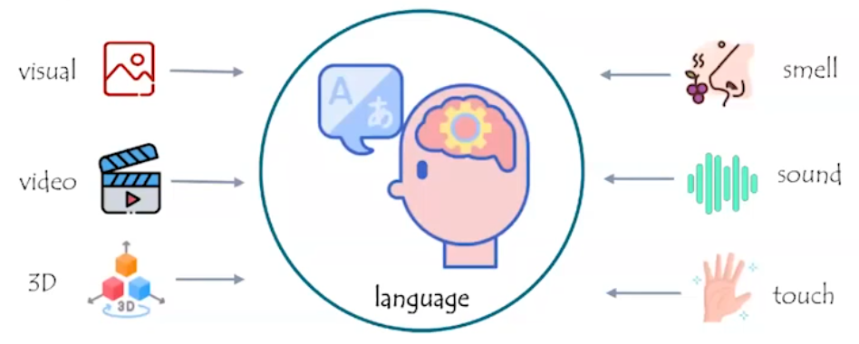
</div>

---

## 2. Static Benchmarks
### 2.1 GQA: Compositional Visual Question Answering Benchmark
> **Hudson A. et al.** *"GQA: A New Dataset for Real-World Visual Reasoning and Compositional Question Answering"*  
**CVPR 2019** | [Article](https://arxiv.org/pdf/1902.09506) | [Dataset](https://cs.stanford.edu/people/dorarad/gqa/)

GQA (Visual Question Answering) — это датасет для оценки способности моделей к реальному визуальному мышлению, по композиционным вопросам.

> В оригинальной статье авторы *(Hudson & Manning)* намеренно не дают явной расшифровки аббревиатуры.

#### 📌 Характеристики датасета
- **113k изображений** собранных с Flickr
- **22.6M вопросов** сложных композиционных вопросов
- **Графовая разметка**:  
  - Полуавтоматическое выделение объектов и связей (стрелки, подписи)  
  - Семантическая структура диаграмм → вопросы  
- 📊 **Метрика**: Accuracy

[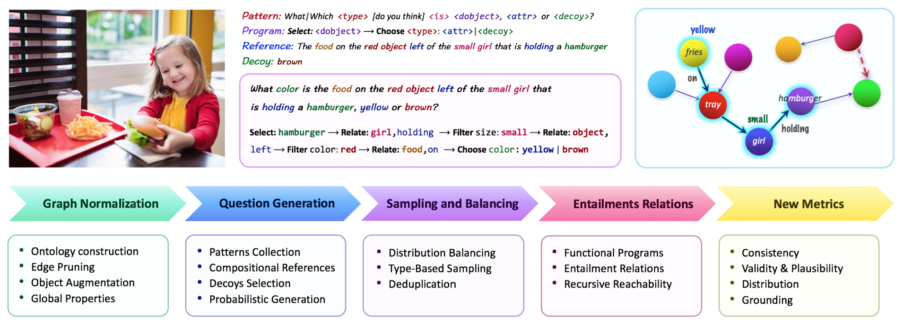](https://arxiv.org/pdf/1902.09506)

**Методология создания датасета**
1. **Графовая разметка изображений**:
    - Каждое изображение аннотируется как ориентированный граф
    - Узлы графа - это объекты на изображении (чашка, девочка, гамбургер)
    - Каждый узел может иметь несколько аттрибутов (например, цвет, форма, текстура, состояние)
    - Ребра графа - это пространственные и семантические отношения между узлами
    - Пространственные: "слева от", "на", "под", "за"
    - Действия или же глаголы: "держит", "ест", "смотрит на"

2. **Генерация вопросов**:
  Далее по такой разметке можно генерировать большое количество вопросов. В начале берутся какие-то паттерны вопросов, и добавляются правила обхода графа. Стартуя с какой-то вершины и можем задавать вопросы либо про атрибуты либо про отношение между объектами, и чем больше пройдем по графу, тем сложнее вопросы становятся, но можно выделить 3 типа вопросов:
    1. **Атрибутивные** (о свойствах объектов):
    *"Какого цвета чашка?"*
    2. **Реляционные** (о связях между объектами):
    *"Что держит девочка?"*
    3. **Композиционные** (многоуровневые):
    *"Какого цвета еда на красном объекте слева от девочки?"*


### 2.2 AI2D Diagram Understanding Benchmark
> **Kembhavi A. et al.** *"A Diagram is Worth A Dozen Images"*  
**ECCV 2016** | [Article](https://arxiv.org/pdf/1603.07396) | [Dataset](https://huggingface.co/datasets/lmms-lab/ai2d)

#### 📌 Характеристики датасета
- **5k изображений** из школьных учебников (физика, биология)  
- **15k вопросов** с множественным выбором (*multiple choice*)  
- **Графовая разметка**:  
  - Полуавтоматическое выделение объектов и связей (стрелки, подписи)  
  - Семантическая структура диаграмм → вопросы  
- 📊 **Метрика**: Accuracy

[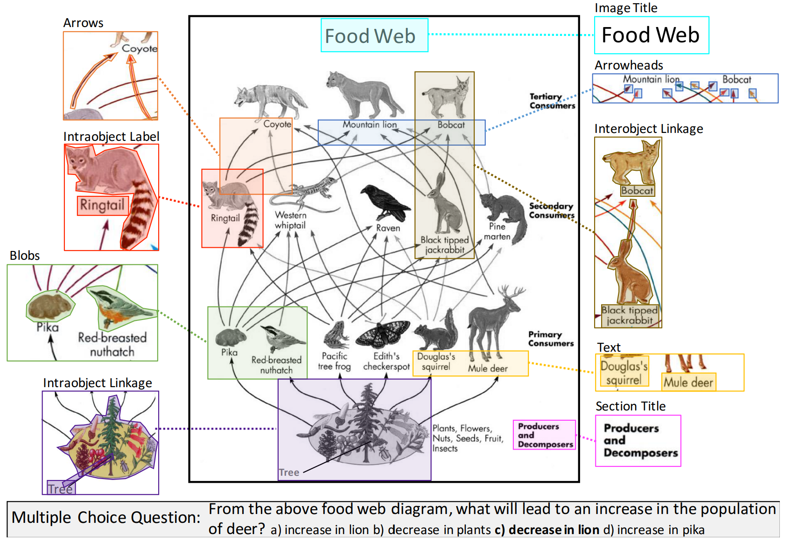](https://arxiv.org/pdf/1603.07396)

#### 🔧 Исходные задачи
1. **Diagram Parsing**
   Отображение картинок в граф диаграммы. Т.е с начала отдельной моделью парсят картинку и получают граф.
2. **Question Answering**  
   Чтобы из графа получить ответ на вопрос, его текстовое описание подается в LLM вместе с вопросом. 

> *Современный подход*: Используют End-to-end подход к предсказаниям, т.е напрямую из изображения диаграммы, вместе с вопросом, получают ответ (в таком формате обычно этот датасет используется для тестирования моделей). 


### 2.3 MMMU: Massive Multi-discipline Multimodal Understanding Benchmark
> **X. Yue. et al.** *"MMMU: A Massive Multi-discipline Multimodal Understanding and Reasoning Benchmark for Expert AGI"*  
**CVPR 2024** | [Article](https://arxiv.org/pdf/2311.16502) | [Dataset](https://huggingface.co/datasets/MMMU/MMMU)

#### 📌 Характеристики датасета
- **11.5k вопросов с изображениями** из 6 университетских дисциплин:
    - бизнес
    - искусство и дизайн
    - инженерия
    - медицина
    - социальные науки
    - ествественные науки (математика)
- **95%** вопросов с множественным выбором, **5%** — открытые
- **Источники**:
    - Учебники университетского уровня (тщательно проверенные на соответствие лицензиям)
    - Тестовые задания и задачи с экспертными решениями
- 📊 **Метрика**: Accuracy

[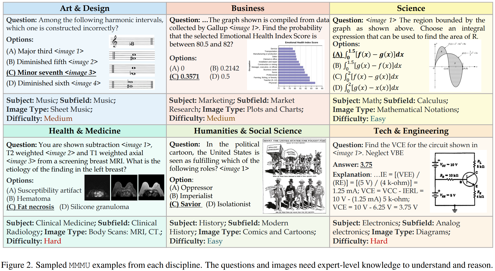](https://arxiv.org/pdf/2311.16502)

#### 🔧 Методология оценки
- Автоматическая проверка:
  - Для вопросов с выбором - точность (Accuracy)
  - Для открытых вопросов - ответы извлекались используя сложный пайплайн rexexps


### 2.4 TextVQA: Visual Question Answering in Text-Rich Images
> **Singh et al.** *"Towards VQA Models That Can Read"*  
**CVPR 2019** | [Article](https://arxiv.org/pdf/1904.08920) | [Dataset](https://textvqa.org/)

#### 📌 Характеристики датасета 
- **28k изображений** с текстовыми элементами (вывески, этикетки, цифры)
- **45k вопросов**, требующих чтения текста на изображении
- **10 референсных ответов** на каждый вопрос (аннотировано краудсорсингом)
- **Источник данных**:  
   - Фильтрация исходного датасета VQA v2.0  
   - Дополнительный сбор текстоемких изображений  
- 📊 **Метрика**: VQA accuracy (нормализованная точность)

[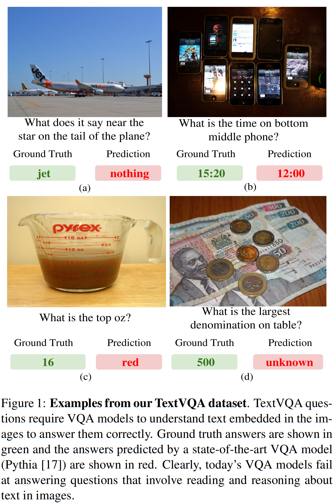](https://arxiv.org/pdf/1904.08920)

#### 🔍 Ключевые особенности  
1. **Цель создания**:  
   - Тестирование способности моделей **к чтению и интерпретации текста** в визуальном контексте  
   - Пример вопроса:  
     *"Какой номер на билете у человека в красной шапке?"*

2. **Методология оценки**:  
   - Ответ модели сравнивается с 10 эталонными ответами  
   - Оценка точности:  
     - 100% — если ответ совпадает с ≥3 референсами
     - 66% — если совпадает с 2 референсами
     - 33% — если совпадает с 1 референсом


Авторы заметили, что достаточно много вопросов о сцене можно спросить у модели, с которыми нельзя справиться если не уметь распознавать символы или цифры.


#### 2.5 DocVQA: A Dataset for Multimodal Document Understanding
> **Mathew et al.** *"DocVQA: A Dataset for VQA on Document Images"*  
**WACV 2021** | [Article](https://arxiv.org/pdf/2007.00398) | [Dataset](https://www.docvqa.org/datasets)

#### 📌 Характеристики датасета  
- **50k изображений документов**  
- **12k вопросов** с аннотированными ответами  
- **Источники данных**:  
  - Публичные архивы американских библиотек  
  - Преимущественно документы 1960-2000 гг.  
  - Основные отрасли:  
    - Табачная промышленность  
    - Фармацевтика  
    - Химическая промышленность  
    - Пищевая промышленность  
    - Топливно-энергетический комплекс  

#### 📊 Метрики оценки  
1. **Accuracy** (точность совпадения ответов)  
2. **Average Normalized Levenshtein Similarity (ANLS)**  
   - Нормализованное расстояние Левенштейна (0-100)  
   - Учитывает орфографические вариации и опечатки  
   - Формула:  
     ```
     ANLS = 1 - min(1, levenshtein_distance(pred, gt) / max_len(pred, gt))
     ```

[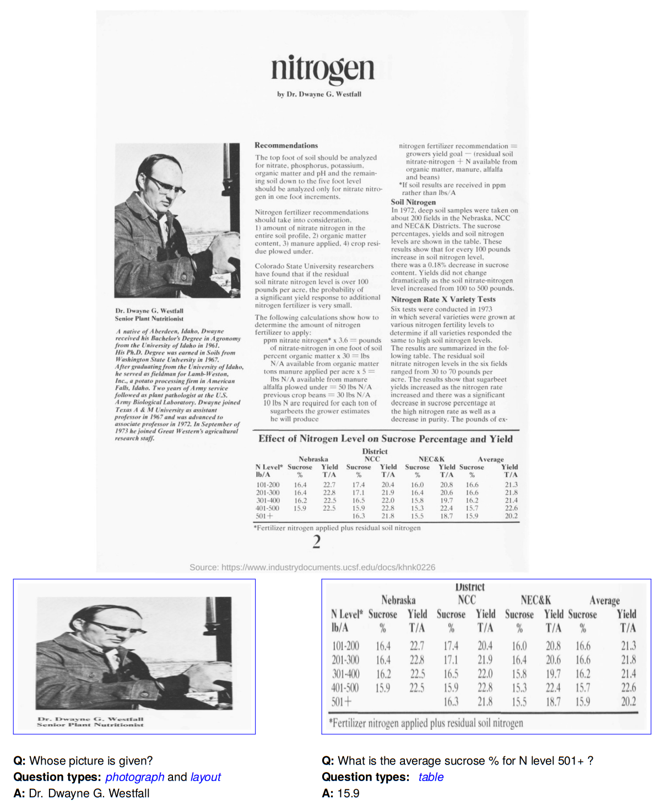](https://arxiv.org/pdf/2007.00398)


#### 🔍 Ключевые особенности  
1. **Специфика документов**:  
   - Сложная структура (таблицы, схемы, многоуровневые списки)  
   - Требуется понимание:  
     - Пространственной организации  
     - Семантических связей между блоками  
   - Пример вопроса:  
     *"Какая максимальная дозировка указана в разделе 'Побочные эффекты'?"*  


---


### 3. Arena: Dynamic Benchmarking for Multimodal Chatbots  

#### 📌 Определение и назначение  
**Arena** — интерактивная платформа для сравнительной оценки MLLM через прямое взаимодействие с пользователями.  

**Ключевые реализации**:  
- [Chatbot Arena](https://arena.lmsys.org) от LMSYS (лидер в области открытых оценок)  
- [Vicuna Benchmark](https://vicuna.lmsys.org)  

#### 🔧 Принцип работы  
1. **Вводный этап**:  
   - Пользователь загружает мультимодальный запрос (текст + изображение/документ)  
2. **Генерация ответов**:  
   - Две анонимизированные модели-конкуренты независимо обрабатывают запрос  
3. **Человеческая оценка**:  
   - Пользователь выбирает лучший ответ слепым методом  
4. **Ранжирование**:  
   - На основе голосов строится Elo-рейтинг моделей  

#### 📊 Методологические особенности  
| Характеристика       | Статические бенчмарки | Arena |  
|----------------------|-----------------------|-------|  
| Оценка               | Автоматическая        | Человеческая |  
| Сценарии использования | Искусственные       | Реальные |  
| Покрытие кейсов      | Фиксированное         | Динамическое |  
| Основная метрика     | Accuracy/F1           | Win Rate |  

#### 💡 Преимущества подхода  
1. **Выявление "human preferences"**:  
   - Оценка естественности, креативности, контекстуальной релевантности  
   - Пример: *"Модель A выигрывает у B в 68% диалогов про кулинарные рецепты"*  

2. **Обнаружение edge cases**:  
   - Тестирование на запросах вне покрытия стандартных бенчмарков  
   - *Кейс*: запросы с культурными отсылками или профессиональным жаргоном  

3. **Валидация статических метрик**:  
   - Корреляционный анализ (напр., между Accuracy в VQA v2 и Arena win rate)  

#### 🚧 Ограничения  
- **Биасы оценщиков**: предвзятость к длинным/формальным ответам  
- **Вычислительные затраты**: требуется массовое участие людей  
- **Репродуцируемость**: сложность прямого сравнения разных сессий

#### 📝 Рекомендации для исследований  
1. Всегда дополнять статические тесты Arena-оценкой  
2. Контролировать распределение запросов по доменам  
3. Учитывать демографию оценщиков (культурные/языковые предпочтения)  

Для вашего конспекта можно добавить:  
- Сравнение интерфейсов (напр., слепая vs явная оценка моделей)  
- Кейсы расхождений между метриками и человеческим выбором

### 3.1 WildVision-Arena
> **Yujie Lu et al.** *"WildVision: Evaluating Vision-Language Models in the Wild with Human Preferences"*  
**NeurIPS 2024 2024** | [Article](https://arxiv.org/pdf/2406.11069) | [Dataset](https://huggingface.co/spaces/WildVision/vision-arena)


[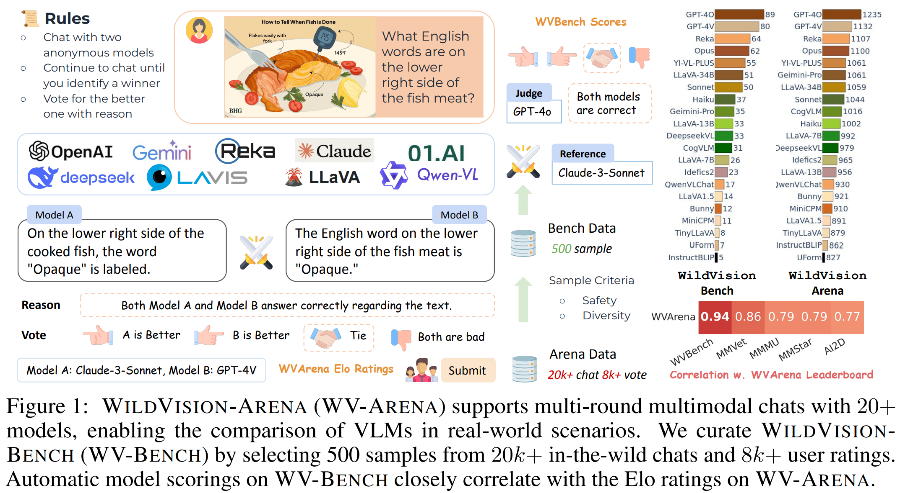](https://arxiv.org/pdf/2406.11069)

#### Распределение вопросов
После того как авторы запустили такую арену, они получили 8k раундов, для разных моделей, тут можно посмотреть виды вопросов какие они бывают
[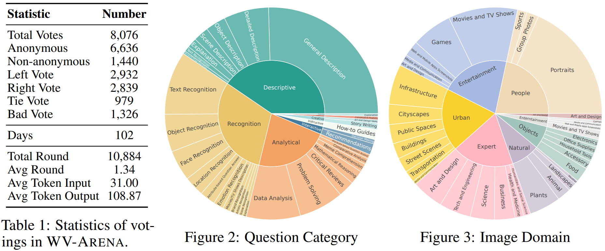](https://arxiv.org/pdf/2406.11069)

#### Битвы между моделями
Слева показана визуализация раундов для моделей A и B, понятное дело что она симметричная матрица, справа же винрейт для соответствующих пар моделей (она уже не симметричная).
[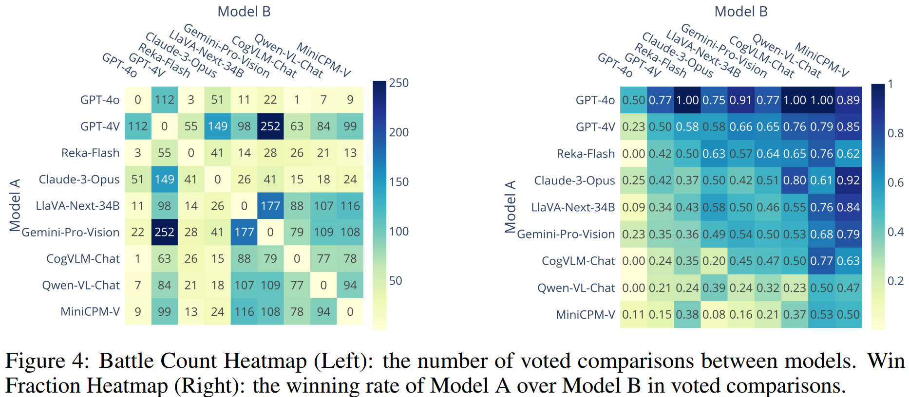](https://arxiv.org/pdf/2406.11069)


#### Elo computation
[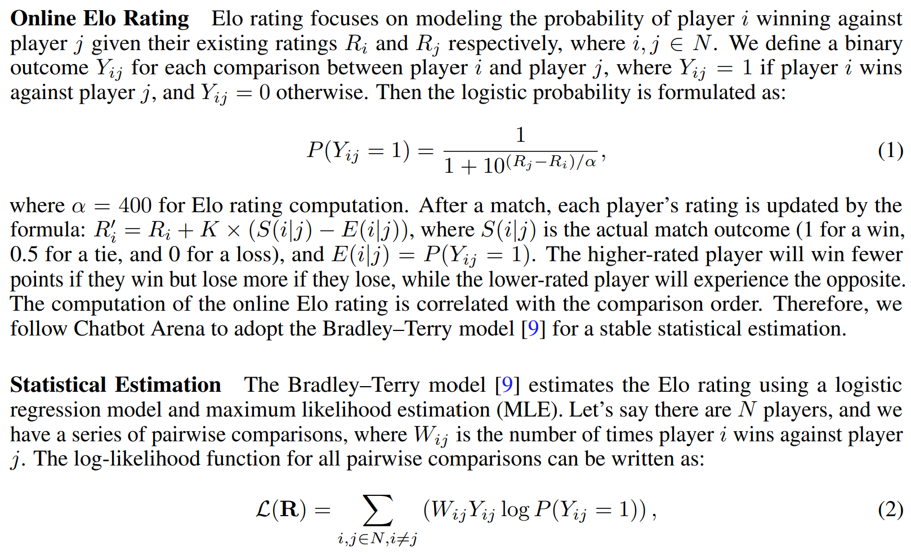](https://arxiv.org/pdf/2406.11069)

**Online Elo rating**
После того как мы получили сырые числа, мы можем считать рейтинг Elo. Он считается следующим образом, есть числа R_i и R_j, которые являются рейтингами моделей i и j соответственно. Бинарный результат победы модели i над моделью j обозначается как Y_{ij}, тогда вероятность победы модели i над моделью j вычисляется следующим образом, по сути здесь мы используем сигмоиду для разницы рангов:
$$
P(i \text{ wins } j) = \frac{1}{1 + 10^{(R_j - R_i) / \alpha}}
$$
если параметр \alpha = 400, тогда это тот же рейтинг что используется в шахматах.

Есть способ обновлять эти рейтинги в онлайне, т.е каждрый раз когда пользователь оценил две модели, или когда два шахматиста сыграли с друг другом, то можно сделать некоторую поправку к рейтингу.

**Statistical Estimation**
Если же есть данные в офлайне, то используя логистическую регрессию и максимизацию правдоподобия (Maximum Likelihood Estimation) можно оценить рейтинг для каждой модели.

Есть вирнейт W_{ij} - сколько раз одна модель побеждала жругую модель.
Функция логарифма правдоподобия, для всех попарных сравнений, может быть записана как:
$$
\mathbf{\mathcal{L}}(\mathbf{R}) = \sum_{i,j \in N, i \neq j} W_{ij} Y_{ij} \log P(Y_{ij} = 1)
$$
Т.е в результате получается функция которая зависит от рангов, можем её оптимизировать, чтобы максимизировать правдоподобие, и таким образом получить какие-то значение рангов уже финальные.


### 3.2 Elo Rating for Model Evaluation  

#### Online Elo Rating  
**Формула вероятности победы модели**  
Для моделей \( i \) и \( j \) с рейтингами \( R_i \) и \( R_j \) соответственно:  
$$
P(i \text{ wins } j) = \frac{1}{1 + 10^{(R_j - R_i)/\alpha}} \quad (\alpha = 400)
$$  

**Онлайн-обновление рейтинга**:  
После каждого сравнения рейтинг обновляется по формуле:  
$$
R'_i = R_i + K \times (S(i|j) - E(i|j))
$$  
где:  
- \( S(i|j) \in \{0, 0.5, 1\} \) — фактический результат (победа/ничья/поражение)  
- \( E(i|j) = P(Y_{ij} = 1) \) — ожидаемая вероятность победы  
- \( K \) — коэффициент чувствительности (обычно \( K=32 \))  

#### Statistical Estimation (Bradley-Terry Model)  
Для офлайн-оценки по историческим данным:  

**Функция правдоподобия**:  
$$
\mathcal{L}(\mathbf{R}) = \sum_{\substack{i,j \in N \\ i \neq j}} W_{ij} \left[ Y_{ij} \log P(Y_{ij}=1) + (1-Y_{ij}) \log P(Y_{ij}=0) \right]
$$  
где:  
- \( W_{ij} \) — количество побед модели \( i \) над \( j \)  
- \( Y_{ij} \in \{0,1\} \) — бинарный исход сравнения  

**Особенности реализации**:  
1. Учёт ничьих через дублирование данных:  
   - 50% ничьих трактуются как победа \( i \)  
   - 50% — как победа \( j \)  
2. Оптимизация методом максимума правдоподобия (MLE)  

#### 🖼️ Визуализация (WildVision Benchmark)  
<div align="center">
  
  <p style="font-style:italic; margin-top:0.5em">
    Распределение Elo-рейтингов моделей в WildVision (NeurIPS 2024)
  </p>
</div>

#### 💡 Ключевые положения из статьи  
1. **Корреляция с порядком сравнений**:  
   - Онлайн-версия чувствительна к последовательности оценок  
   - Bradley-Terry модель обеспечивает стабильность  

2. **Практические модификации**:  
   - Для OpenEQA введён параметр \( \alpha = 200 \) (уменьшенный разброс рейтингов)  
   - Динамическая регулировка \( K \) для новых моделей  

#### 📝 Пример вычислений  
Для \( R_i = 1500 \), \( R_j = 1600 \):  
$$
E(i|j) = \frac{1}{1 + 10^{(1600-1500)/400}} \approx 0.36 \\
\text{При победе } i: \Delta R_i = 32 \times (1 - 0.36) \approx +20.5
$$

#### Сравнение методов  
| Метод           | Преимущества                          | Ограничения                 |  
|-----------------|---------------------------------------|-----------------------------|  
| **Online Elo**  | Реалтайм-адаптация                    | Зависит от порядка оценок   |  
| **Bradley-Terry** | Стабильность, объективность         | Требует большого объёма данных |  

Для вашего конспекта:  
- Добавьте ссылку на [Chatbot Arena implementation](https://github.com/lm-sys/FastChat/tree/main/fastchat/llm_judge)  
- Укажите критику Elo (например, невозможность сравнения моделей без общих оппонентов)


---

## 4. Architecture
### 📌 Общий паттерн построения MLLM
1. **Энкодеры для модальностей**:  
   - Изображения → Vision Encoder (ViT, ResNet).  
   - Текст → LLM (Llama, GPT).  
2. **Механизм слияния (fusion)**:  
   - Early fusion / Late fusion.  
3. **Декодер**: генерация ответа (часто та же LLM).  

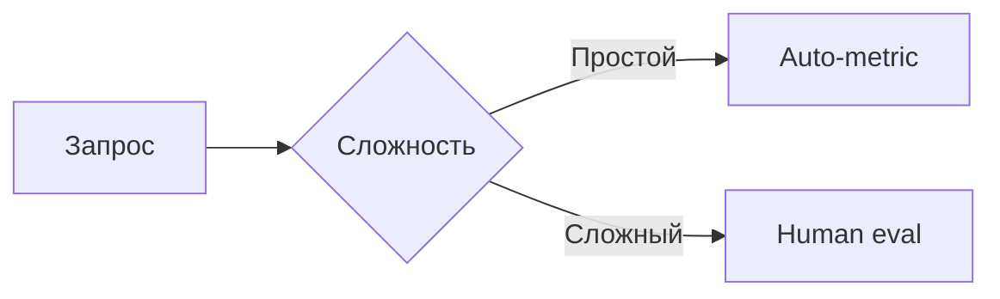

### 🧩 Вариации компонентов
*(Заметки про то, как можно менять каждый блок)*  
- *Пример: "В LLaVA вместо CLIP используют простой MLP-проектор"*  

---

## 5. Overview of several popular models
### 📌 Примеры открытых MLLM
1. **LLaVA**  
   - Архитектура: CLIP + Llama.  
   - Плюсы: легковесная, хороша для research.  
2. **Flamingo**  
   - Архитектура: Perceiver Resampler + Chinchilla.  
   - Плюсы: поддержка видео.  

### 🔍 Почему не GPT-4V?  
*(Закрытость API, неизвестность архитектуры и данных обучения)*  

---

## 📚 Дополнительные материалы
- [Ссылки на статьи (например, LLaVA)](https://arxiv.org/...)  
- [Chatbot Arena](https://arena.lmsys.org/)  
