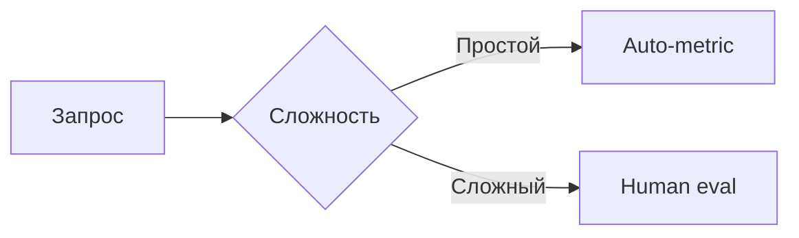

# **[ШАД] Лекция 1: Intro to MLLMs. Image Modality**

> **MLLMs** (Multimodal Large Language Models) — модели, работающие с несколькими модальностями (текст + изображение/аудио/видео).


## **1. MLLMs как шаг к AGI**
**MLLMs** - естественный этап развития искусственного интеллекта в сторону **AGI**. Их создание основано на гипотезе, что обработка множества модальностей приближает модели к человеческому мышлению.

### **🔍 Основные аспекты**
1. **Сенсорная интеграция (Sensor Fusion)**  
   Объединение данных разных типов (текст, изображения и др.) позволяет моделям воспринимать информацию комплексно, как это делает человек.

2. **Использование знаний LLM**  
   Языковые модели служат универсальной базой знаний о мире. Добавление других модальностей (например, визуальной) расширяет их способность к рассуждениям.  
   *Пример*: В отличие от классического компьютерного зрения, MLLM анализируют изображения в контексте языковых знаний.

3. **Новые возможности на стыке модальностей**  
   Комбинация текста и изображений открывает уникальные приложения:  
   - Визуальный поиск,  
   - Генерация контента,  
   - Медицинская диагностика по снимкам + анамнезу.

4. **Повышение качества через мультимодальные паттерны**  
   Совместная обработка данных выявляет скрытые закономерности, недоступные для одномодальных моделей.  
   *Пример*: Модель может коррелировать стиль изображения с эмоциональной окраской текста.

<div style="text-align: center">
  
</div>


## **2. Static Benchmarks**
### **2.1 GQA: Compositional Visual Question Answering Benchmark**
> **Hudson A. et al.** *"GQA: A New Dataset for Real-World Visual Reasoning and Compositional Question Answering"*  
**CVPR 2019** | [Article](https://arxiv.org/pdf/1902.09506) | [Dataset](https://cs.stanford.edu/people/dorarad/gqa/)

GQA (Visual Question Answering) — это датасет для оценки способности моделей к реальному визуальному мышлению, по композиционным вопросам.

> В оригинальной статье авторы *(Hudson & Manning)* намеренно не дают явной расшифровки аббревиатуры.

#### **📌 Характеристики датасета**
- **113k изображений** собранных с Flickr
- **22.6M вопросов** сложных композиционных вопросов
- **Графовая разметка**:  
  - Полуавтоматическое выделение объектов и связей (стрелки, подписи)  
  - Семантическая структура диаграмм → вопросы  
- 📊 **Метрика**: Accuracy

[](https://arxiv.org/pdf/1902.09506)

**Методология создания датасета**
1. **Графовая разметка изображений**:
    - Каждое изображение аннотируется как ориентированный граф
    - Узлы графа - это объекты на изображении (чашка, девочка, гамбургер)
    - Каждый узел может иметь несколько аттрибутов (например, цвет, форма, текстура, состояние)
    - Ребра графа - это пространственные и семантические отношения между узлами
    - Пространственные: "слева от", "на", "под", "за"
    - Действия или же глаголы: "держит", "ест", "смотрит на"

2. **Генерация вопросов**:
  Далее по такой разметке можно генерировать большое количество вопросов. В начале берутся какие-то паттерны вопросов, и добавляются правила обхода графа. Стартуя с какой-то вершины и можем задавать вопросы либо про атрибуты либо про отношение между объектами, и чем больше пройдем по графу, тем сложнее вопросы становятся, но можно выделить 3 типа вопросов:
    1. **Атрибутивные** (о свойствах объектов):
    *"Какого цвета чашка?"*
    2. **Реляционные** (о связях между объектами):
    *"Что держит девочка?"*
    3. **Композиционные** (многоуровневые):
    *"Какого цвета еда на красном объекте слева от девочки?"*


### **2.2 AI2D Diagram Understanding Benchmark**
> **Kembhavi A. et al.** *"A Diagram is Worth A Dozen Images"*  
**ECCV 2016** | [Article](https://arxiv.org/pdf/1603.07396) | [Dataset](https://huggingface.co/datasets/lmms-lab/ai2d)

#### **📌 Характеристики датасета**
- **5k изображений** из школьных учебников (физика, биология)  
- **15k вопросов** с множественным выбором (*multiple choice*)  
- **Графовая разметка**:  
  - Полуавтоматическое выделение объектов и связей (стрелки, подписи)  
  - Семантическая структура диаграмм → вопросы  
- 📊 **Метрика**: Accuracy

[](https://arxiv.org/pdf/1603.07396)

#### **🔧 Исходные задачи**
1. **Diagram Parsing**
   Отображение картинок в граф диаграммы. Т.е с начала отдельной моделью парсят картинку и получают граф.
2. **Question Answering**  
   Чтобы из графа получить ответ на вопрос, его текстовое описание подается в LLM вместе с вопросом. 

> *Современный подход*: Используют End-to-end подход к предсказаниям, т.е напрямую из изображения диаграммы, вместе с вопросом, получают ответ (в таком формате обычно этот датасет используется для тестирования моделей). 


### **2.3 MMMU: Massive Multi-discipline Multimodal Understanding Benchmark**
> **X. Yue. et al.** *"MMMU: A Massive Multi-discipline Multimodal Understanding and Reasoning Benchmark for Expert AGI"*  
**CVPR 2024** | [Article](https://arxiv.org/pdf/2311.16502) | [Dataset](https://huggingface.co/datasets/MMMU/MMMU)

#### **📌 Характеристики датасета**
- **11.5k вопросов с изображениями** из 6 университетских дисциплин:
    - бизнес
    - искусство и дизайн
    - инженерия
    - медицина
    - социальные науки
    - ествественные науки (математика)
- **95%** вопросов с множественным выбором, **5%** — открытые
- **Источники**:
    - Учебники университетского уровня (тщательно проверенные на соответствие лицензиям)
    - Тестовые задания и задачи с экспертными решениями
- 📊 **Метрика**: Accuracy

[](https://arxiv.org/pdf/2311.16502)

#### **🔧 Методология оценки**
- Автоматическая проверка:
  - Для вопросов с выбором - точность (Accuracy)
  - Для открытых вопросов - ответы извлекались используя сложный пайплайн rexexps


### **2.4 TextVQA: Visual Question Answering in Text-Rich Images**
> **Singh et al.** *"Towards VQA Models That Can Read"*  
**CVPR 2019** | [Article](https://arxiv.org/pdf/1904.08920) | [Dataset](https://textvqa.org/)

#### **📌 Характеристики датасета**
- **28k изображений** с текстовыми элементами (вывески, этикетки, цифры)
- **45k вопросов**, требующих чтения текста на изображении
- **10 референсных ответов** на каждый вопрос (аннотировано краудсорсингом)
- **Источник данных**:  
   - Фильтрация исходного датасета VQA v2.0  
   - Дополнительный сбор текстоемких изображений  
- 📊 **Метрика**: VQA accuracy (нормализованная точность)

[](https://arxiv.org/pdf/1904.08920)

#### **🔍 Ключевые особенности**
1. **Цель создания**:  
   - Тестирование способности моделей **к чтению и интерпретации текста** в визуальном контексте  
   - Пример вопроса:  
     *"Какой номер на билете у человека в красной шапке?"*

2. **Методология оценки**:  
   - Ответ модели сравнивается с 10 эталонными ответами  
   - Оценка точности:  
     - 100% — если ответ совпадает с ≥3 референсами
     - 66% — если совпадает с 2 референсами
     - 33% — если совпадает с 1 референсом


Авторы заметили, что достаточно много вопросов о сцене можно спросить у модели, с которыми нельзя справиться если не уметь распознавать символы или цифры.


#### **2.5 DocVQA: A Dataset for Multimodal Document Understanding**
> **Mathew et al.** *"DocVQA: A Dataset for VQA on Document Images"*  
**WACV 2021** | [Article](https://arxiv.org/pdf/2007.00398) | [Dataset](https://www.docvqa.org/datasets)

#### **📌 Характеристики датасета**
- **50k изображений документов**  
- **12k вопросов** с аннотированными ответами  
- **Источники данных**:  
  - Публичные архивы американских библиотек  
  - Преимущественно документы 1960-2000 гг.  
  - Основные отрасли:  
    - Табачная промышленность  
    - Фармацевтика  
    - Химическая промышленность  
    - Пищевая промышленность  
    - Топливно-энергетический комплекс  

#### **📊 Метрики оценки**
1. **Accuracy** (точность совпадения ответов)  
2. **Average Normalized Levenshtein Similarity (ANLS)**  
   - Нормализованное расстояние Левенштейна (0-100)  
   - Учитывает орфографические вариации и опечатки  
   - Формула:  
     ```
     ANLS = 1 - min(1, levenshtein_distance(pred, gt) / max_len(pred, gt))
     ```

[](https://arxiv.org/pdf/2007.00398)


#### **🔍 Ключевые особенности**
1. **Специфика документов**:  
   - Сложная структура (таблицы, схемы, многоуровневые списки)  
   - Требуется понимание:  
     - Пространственной организации  
     - Семантических связей между блоками  
   - Пример вопроса:  
     *"Какая максимальная дозировка указана в разделе 'Побочные эффекты'?"*  


## **3. Arena: Dynamic Benchmarking for Multimodal Chatbots**
> **Arena** — интерактивная платформа для сравнительной оценки MLLM через прямое взаимодействие с пользователями.  

**Ключевые реализации**:  
- [Chatbot Arena](https://arena.lmsys.org) от LMSYS (лидер в области открытых оценок)  
- [Vicuna Benchmark](https://vicuna.lmsys.org)  

### **🔧 Принцип работы**
1. **Вводный этап**:  
   - Пользователь загружает мультимодальный запрос (текст + изображение/документ)  
2. **Генерация ответов**:  
   - Две анонимизированные модели-конкуренты независимо обрабатывают запрос  
3. **Человеческая оценка**:  
   - Пользователь выбирает лучший ответ слепым методом  
4. **Ранжирование**:  
   - На основе голосов строится Elo-рейтинг моделей  

### **📊 Методологические особенности**
| Характеристика       | Статические бенчмарки | Arena |  
|----------------------|-----------------------|-------|  
| Оценка               | Автоматическая        | Человеческая |  
| Сценарии использования | Искусственные       | Реальные |  
| Покрытие кейсов      | Фиксированное         | Динамическое |  
| Основная метрика     | Accuracy/F1           | Win Rate |  

### **💡 Преимущества подхода**
1. **Выявление "human preferences"**:  
   - Оценка естественности, креативности, контекстуальной релевантности  
   - Пример: *"Модель A выигрывает у B в 68% диалогов про кулинарные рецепты"*  

2. **Обнаружение edge cases**:  
   - Тестирование на запросах вне покрытия стандартных бенчмарков  
   - *Кейс*: запросы с культурными отсылками или профессиональным жаргоном  

3. **Валидация статических метрик**:  
   - Корреляционный анализ (напр., между Accuracy в VQA v2 и Arena win rate)  

### **🚧 Ограничения**
- **Биасы оценщиков**: предвзятость к длинным/формальным ответам  
- **Вычислительные затраты**: требуется массовое участие людей  
- **Репродуцируемость**: сложность прямого сравнения разных сессий


### **3.1 WildVision-Arena**
> **Yujie Lu et al.** *"WildVision: Evaluating Vision-Language Models in the Wild with Human Preferences"*  
**NeurIPS 2024 2024** | [Article](https://arxiv.org/pdf/2406.11069) | [Dataset](https://huggingface.co/spaces/WildVision/vision-arena)


[](https://arxiv.org/pdf/2406.11069)

#### **Распределение вопросов**
После того как авторы запустили такую арену, они получили 8k раундов, для разных моделей, тут можно посмотреть виды вопросов какие они бывают
[](https://arxiv.org/pdf/2406.11069)

#### **Битвы между моделями**
Слева показана визуализация раундов для моделей A и B, понятное дело что она симметричная матрица, справа же винрейт для соответствующих пар моделей (она уже не симметричная).
[](https://arxiv.org/pdf/2406.11069)


#### **Elo Rating for Model Evaluation**  

##### **Online Elo Rating**  
Формула вероятности победы модели $i$ над $j$ с рейтингами $R_i$ и $R_j$ соответственно:  
```math
P(i  j) = \frac{1}{1 + 10^{(R_j - R_i)/\alpha}}
```
где $\alpha$ - коэффициент чувствительности (если $\alpha = 400$, то это шахматный рейтинг).

**Онлайн-обновление рейтинга**:  
После каждого сравнения рейтинг обновляется по формуле:  
```math
R'_i = R_i + K \times (S(i|j) - E(i|j))
``` 

где:
```math
S(i|j) \in \{0, 0.5, 1\}
```
фактический результат (победа/ничья/поражение)

```math
- $E(i|j) = P(Y_{ij} = 1)$ — ожидаемая вероятность победы  
- $K$ — коэффициент чувствительности (обычно $K=32$)  
```

##### **Statistical Estimation (Bradley-Terry Model)**
> Модель Бредли-Терри (**Bradley-Terry**) - статистическая модель для предсказания вероятности исхода парных сравнений (pairwise comparisons). Она предполагает, что вероятность победы одного объекта над другим зависит только от их относительных характеристик.

Модель Бредли-Терри оценивает рейтинг Elo используя логистическую регрессию и максимизацию правдоподобия (**MLE** - Maximum Likelihood Estimation).
Пусть есть $N$ игроков, для которых есть серия их попарных сравнений, где:  
- $W_{ij}$ — winrate, количество побед модели $i$ над $j$
- $Y_{ij} \in \{0,1\}$ — бинарный исход сравнения
- $\mathbf{R} = \{R_1, R_2, \dots, R_N\}$ — вектор Elo-рейтингов всех игроков.

**Функция логарифма правдоподобия**, всех попарных сравнений, для офлайн-оценки по историческим данным, может быть записана как:
```math
\mathcal{L}(\mathbf{R}) = \sum_{i,j \in N, i \neq j} W_{ij} Y_{ij} \log P(Y_{ij} = 1)
```

Поскольку это моделирование не учитывает равенство голосов, на практике дублируют все голоса и заставляют половину равнодействующих голосов засчитывать как победу левой модели \(i\) $(Y_{ij} = 1)$, а другую половину - как победу правой модели \(j\) $(Y_{ij} = 0)$.


#### **Сравнение методов**  
| Метод           | Преимущества                          | Ограничения                 |  
|-----------------|---------------------------------------|-----------------------------|  
| **Online Elo**  | Реалтайм-адаптация                    | Зависит от порядка оценок   |  
| **Bradley-Terry** | Стабильность, объективность         | Требует большого объёма данных |  


## **4. Architecture**
Мультимодальные LLM могут обрабатывать:
- **Текстовые запросы** (стандартный вход для LLM)
- **Нетекстовые модальности**:
  - Изображения
  - Аудио
  - Видео (выделяют в отдельную модальность, т.к требует специальной обработки кадров и компрессии)

Например, картинку можно сжать, с помощью какого-то энкодера из компьютерного зрения (CLIP, DINO) - после чего получаются картиночные токены.
За такую адаптацию перевода такого специфичного "текста картинок", в токены которые будут понятны для LLM, отвечает **Connector** (ещё его называют **Adapter**/**Proector**, в разных статьях).
По-сути, делается проекция из визуального языка, в язык который больше понятен LLM, а на выход естественный образом мы можем предсказывать текст.


Для того, чтобы предсказывать какую-то другую модальность на выход из LLM, например картинки, нужно дополнительно выходные эмбеддинги подать в какие-то другие модели (диффузионные, генеративные), тоже самое касается для генерации аудио или видео.
Однако, что касается картинок на вход и на выход, то на данный момент это развито сильнее.


### **Encoder**
Рассмотрим подробнее архитектуру энкодеров, начиная с визуальных.

#### **CLIP: Contrastive Language-Image Pretraining**
> **Radford et al.** *"Learning Transferable Visual Models From Natural Language Supervision"*  
**ICML 2021** | [Article](https://arxiv.org/pdf/2103.00020)

На текущий момент стандартом де-факто для кодирования изображений в мультимодальных системах является модель **CLIP**.
Её ключевое преимущество заключается в том, что она обучалась на огромном массиве пар "изображение-текст", что позволяет достичь высокого уровня согласованности между визуальными и текстовыми представлениями.

[](https://arxiv.org/pdf/2103.00020)

CLIP представляет собой симметричную архитектуру, состоящую из двух основных компонентов **Text Encoder** И **Image Encoder**

Оба компонента реализованы на основе трансформерной архитектуры и имеют схожую структуру.
В процессе работы система обрабатывает $N$ пар "изображение-текст".
Текстовый энкодер преобразует текстовые описания в соответствующие векторные представления $T_1, T_2, \dots, T_N$, в то время как визуальный энкодер аналогичным образом преобразует изображения в векторы $I_1, I_2, \dots, I_N$.

Ключевой этап обучения CLIP - сравнение полученных эмбеддингов через построение матрицы скалярных произведений.
Идеальным результатом считается ситуация, когда эта матрица приближается к единичной - то есть когда векторы, соответствующие правильным парам "изображение-текст", оказываются максимально близкими в векторном пространстве, а несоответствующие пары - максимально далёкими.

Первоначальная версия CLIP обучалась на гигантском датасете:
- 400M (image, text) - пары изображений с текстовыми описаниями
- 500 x V100 GPUs for pretraining

Однако современные методы позволяют достигать сравнимого или даже лучшего качества обучения на значительно меньших датасетах и более скромных вычислительных ресурсах.
Например, теперь для обучения подобной модели достаточно одной вычислительной ноды с 8 графическими ускорителями A100, а процесс обучения занимает около трёх дней.


##### **CLIP Softmax Loss**

Обозначим **Image Encoder**, как функцию $f(\cdot)$, а **Text Encoder** как функцию $g(\cdot)$, тогда для мини-батча $B = \{(I_1, T_1), (I_2, T_2), . . . \}$, функция потерь можно записать как:

```math
\mathcal{L} = -\frac{1}{2|\mathcal{B}|} \sum_i^{|\mathcal{B}|} \left(
   \log\frac{e^{t\mathbf{x}_{i} \cdot \mathbf{y}_{i}}} {\sum_{j=1}^{|B|}e^{t\mathbf{x}_{i} \cdot \mathbf{y}_{j}}} + \log \frac{e^{t\mathbf{x}_{i} \cdot \mathbf{y}_{i}}} {\sum_{j=1}^{|B|}e^{t\mathbf{x}_{j}\cdot\mathbf{y}_{i}}}   
\right)
```

где:
```math
\mathbf{x}_{i}=\frac{f(I_{i})}{\|I(I_{i})\|_{2}}
```

```math
\mathbf{y}_{i}\:=\frac{g(T_{i})}{\|\bar{u}(I_{i})\|_{2}}
```

**Проблемы**:
- Вычислительная сложность нормализации SoftMax
- Ограничения памяти для больших батчей

##### **Sigmoid Loss (SigLIP)**
> **Zhai et al.** *"Sigmoid Loss for Language Image Pre-Training"*  
**ICCV 2023** | [Article](https://arxiv.org/pdf/2303.15343)

```math
\mathcal{L} = -\sum_{i=1}^{\mathcal{|B|}} \sum_{j=1}^{\mathcal{|B|}} \mathcal{L}_{ij}
```

```math
\mathcal{L}_{ij} = \log \frac{1}{1 + e^{z_{ij} (-t\mathbf{x}_{i} \cdot \mathbf{y}_{i} + b)}}
```

**Инновации**:
- Замена SoftMax на Sigmoid
- Переход к бинарной классификации (соответствие текст↔изображение)

**Преимущества**:
- Устранение необходимости глобальной нормализации
- Возможность работы с бо́льшими батчами
- Эффективность распределённых вычислений

### 5. Актуальные направления
- SigLIP2 (Google, 2023) - дальнейшая оптимизация
- Видеоэнкодеры временнóй согласованности
- Кросс-модальные архитектуры "всё-в-одном"
```

**Рекомендации по использованию**:
1. Для изображений: CLIP/SigLIP + диффузионные декодеры
2. Для видео: разделение на ключевые кадры + временнáя агрегация
3. Для аудио: спектрограммные представления + адаптеры

**Ссылки**:
- [Оригинальная статья CLIP](https://arxiv.org/abs/2103.00020)
- [SigLIP: Efficient Visual-Language Learning](https://arxiv.org/abs/2303.15343)


### 📌 Общий паттерн построения MLLM
1. **Энкодеры для модальностей**:  
   - Изображения → Vision Encoder (ViT, ResNet).  
   - Текст → LLM (Llama, GPT).  
2. **Механизм слияния (fusion)**:  
   - Early fusion / Late fusion.  
3. **Декодер**: генерация ответа (часто та же LLM).  



### 🧩 Вариации компонентов
*(Заметки про то, как можно менять каждый блок)*  
- *Пример: "В LLaVA вместо CLIP используют простой MLP-проектор"*  

---

## 5. Overview of several popular models
### 📌 Примеры открытых MLLM
1. **LLaVA**  
   - Архитектура: CLIP + Llama.  
   - Плюсы: легковесная, хороша для research.  
2. **Flamingo**  
   - Архитектура: Perceiver Resampler + Chinchilla.  
   - Плюсы: поддержка видео.  

### 🔍 Почему не GPT-4V?  
*(Закрытость API, неизвестность архитектуры и данных обучения)*  

---

## 📚 Дополнительные материалы
- [Ссылки на статьи (например, LLaVA)](https://arxiv.org/...)  
- [Chatbot Arena](https://arena.lmsys.org/)  


